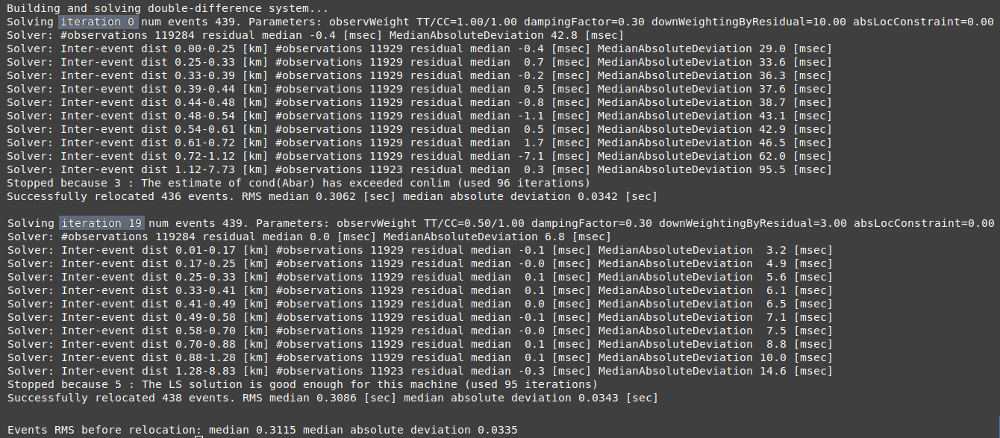
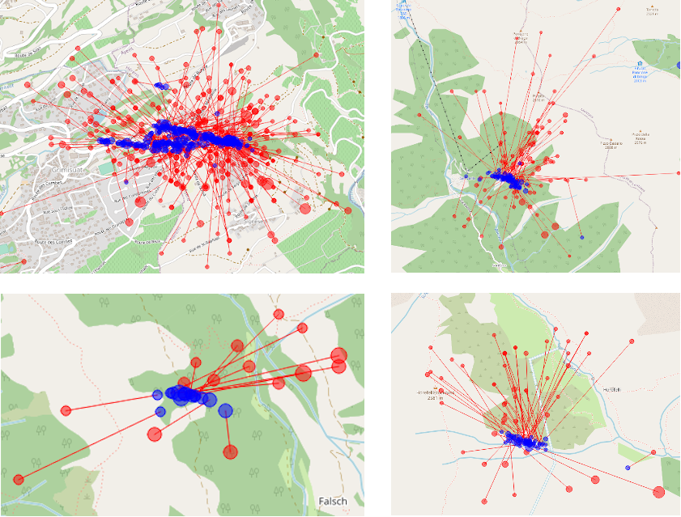
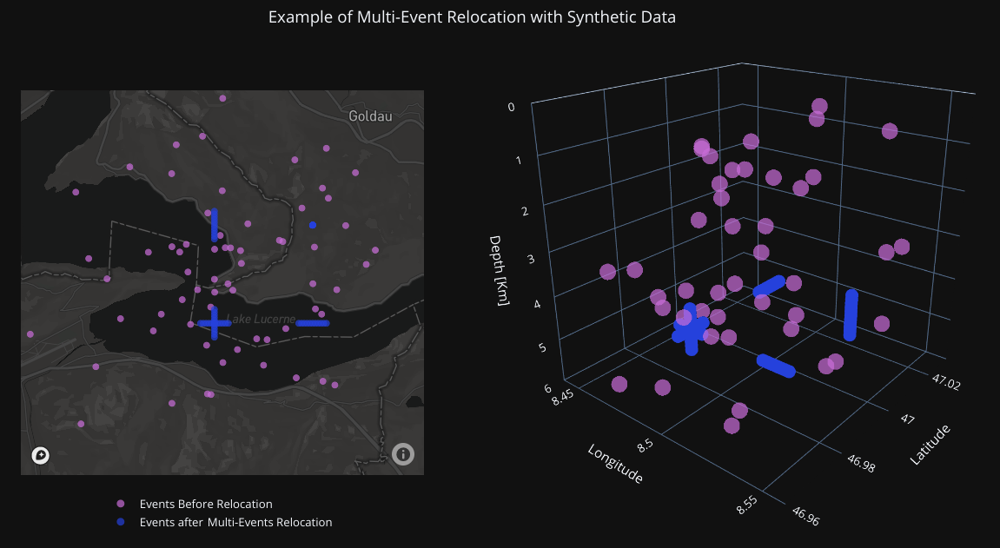

.. _multi-event-label:

Multi-event relocation
======================

Multi-event relocation is used to relocate an event catalog in offline mode.

-------
Summary
-------

* Use `sclistorg` command to select an event catalog from a SeisComP database.
* Create a rtDD profile (e.g. use `scconfig` GUI) which defines the settings for the relocation. The default values provided by rtDD are meant to be a good starting choice, so there is no need to tweak every parameter. However, it is a good choice to configure a custom velocity model.
* Use `scrtdd --reloc-catalog` option to relocate the events.
* Use the relocation output (`reloc-event.csv`, `reloc-phase.csv` and `reloc-stations.csv` or the SCML file `relocated.xml`) as you please

As an example you may want to have a look at `multi-event.sh` script in `this folder <https://github.com/swiss-seismological-service/scrtdd/tree/master/scripts/>`_.

To relocate events not stored in a SeisComP database, refer to :ref:`multi-event-external-data-label`.

--------------
The long story
--------------

To relocate a catalog (multi-event) three pieces of information need to be provided: events data, waveform data and inventory information.

Events data can be provided in three ways:
* A flat file triple `station.csv,event.csv,phase.csv`, which is explained later.
* A file containing the origin ids of events stored in a SeisComP database. In this case an utility `sclistorg` might come in handy to fetch those ids. `sclistorg` is distributed with rtDD and it is explained later.
* A file in `SCML format <https://www.seiscomp.de/doc/base/glossary.html#term-SCML>`_, which is a flavor of QuakeML. It is possible to convert between formats with `sccnv command <https://www.seiscomp.de/doc/apps/sccnv.html>`_ .

Waveform data can to be provided in several formats. See [Waveform data and recordStream configuration](#5-waveform-data-and-recordstream-configuration)) for more information. The first time you try to relocate a catalog downloading the waveforms might takes some time, but then they are stored in a disk cache that avoids further downloading. Also, If the waveforms are not available (e.g. RecordStream not configured), then rtDD will proceed with the relocation anyway, but without refining the differential times via cross-correlation. 

`Inventory information <https://www.seiscomp.de/doc/base/concepts/inventory.html>`_ can be stored in a SeisComP database or provided via command line (`--inventory-db inventory.xml`). In the latter case the inventory has be in SeisComP own station meta-data XML format called inventory ML (the SeisComP documentation provide information on how to convert from standard formats like FDSN StationXML or dataless SEED). When the events are provided as station.csv,event.csv,phase.csv file triplet, the inventory can be passed as an empty inventory ML.

The multi-event relocation itself consists in running the command `scrtdd --reloc-catalog [options]` with appropirate options, discussed later.

The output will be another catalog containing the relocated origins. Depending on the command line options this catalog is stored in plain text files or SCML format (which can be converted to QuakeML).

In multi-event mode there is no interaction with the running SeisComP modules and nothing is writted to the database. It is a safe operation and allow for easy experimentation. However, the SCML output can be stored into the SeisComP database if required. That is optional.

--------------------------------------
Event catalog from SeisComP origin ids
--------------------------------------

There is a tool that is installed alongside rtDD, called `sclistorg`, that is useful for listing origin ids satisfying certain criteria, such as time period, geographic area, author, agency and so on. E.g.::

    # list the preferred origin ids for all events between 2018-11-27 and 2018-12-14
    sclistorg --begin "2018-11-27 00:00:00" --end "2018-12-14 00:00:00" --org-type preferred [db options]

    # select also the event type and the accepted agencies
    sclistorg --begin "2018-11-27 00:00:00" --end "2018-12-14 00:00:00" --org-type preferred \
              --ev-type "earthquake,quarry blast" --inc-agency Agency1,Agency2 [db options]

    # select an area of interest, a rectangle minLat,minLon,maxLat,maxLon
    sclistorg --begin "2018-11-27 00:00:00" --end "2018-12-14 00:00:00" --org-type preferred \
              --area 46.0,8.5,46.5,8.7 [db options]

See `sclistorg --help` for a full list of options.::

    Events:
      --begin arg                   specify the lower bound of the time interval
      --end arg                     specify the upper bound of the time interval
      --modified-after arg          select events modified after the specified time
      --ev-type arg                 include only events whose type is one of the
                                    values provided (comma separated list)
      --simple                      Print only origin ids

    Origins:
      --org-type arg                preferred, last or first (default is preferred)
      --manual-only                 Include only manual origins
      --auto-only                   Inlude only automatic origins
      --inc-author arg              include only origins whose author is one of the
                                    values provided (comma separated list)
      --excl-author arg             exclude origins whose author is one of the
                                    values provided (comma separated list)
      --inc-method arg              include only origins whose methodID is one of
                                    the values provided (comma separated list)
      --excl-method arg             exclue origins whose methodID is one of the
                                    values provided (comma separated list)
      --inc-agency arg              include only origins whose agencyID is one of
                                    the values provided (comma separated list)
      --excl-agency arg             exclude origins whose agencyID is one of the
                                    values provided (comma separated list)
      --area arg                    Include only origins in the rectangular area
                                    provided: MinLat,MinLon,MaxLat,MaxLon

-------------------------
Formats of Events Catalog
-------------------------

The origin ids of the events to be relocated must be stored in a format that rtDD understands.

One of the compatible formats is a text file containing the origin IDs (`sclistorg` output is compatible with that). rtDD will use the origin IDs in the file to fetch all necessary information from the SeisComP database.

E.g. *file myCatalog.csv* (a mandatory column named `seiscompId` is required, but other column might be present too).::

    seiscompId
    Origin/20181214107387.056851.253104
    Origin/20180053105627.031726.697885
    Origin/20190121103332.075405.6234534
    Origin/20190223103327.031726.346363
    [...]

There is another format we can use to store a catalog. This format contains the full origins information, not only the origin ids. So, once the files are generated, there is no need to access the database anymore; so this format is quite fast to load. We can instruct rtDD to generate such a format with the following command::

    scrtdd --dump-catalog myCatalog.csv --verbosity=3 --console=1 [db options]

The above command will generate three files (*event.csv*, *phase.csv* and *stations.csv*) which contain all the information needed by rtDD. 

E.g. *file event.csv* ::

    id,isotime,latitude,longitude,depth,magnitude
    1,2019-11-05T00:54:21.256705Z,46.318264,7.365509,4.7881,3.32
    2,2019-11-05T01:03:06.484287Z,46.320718,7.365435,4.2041,0.64
    3,2019-11-05T01:06:27.140654Z,46.325626,7.356148,3.9756,0.84
    4,2019-11-05T01:12:25.753816Z,46.325012,7.353627,3.7090,0.39

Notes: `magnitude` column is currently not used

E.g. *file station.csv*::

    latitude,longitude,elevation,networkCode,stationCode,locationCode
    45.980278,7.670195,3463.0,4D,MH36,A
    45.978720,7.663000,4003.0,4D,MH48,A
    46.585719,8.383171,2320.4,4D,RA43,
    45.903349,6.885881,2250.0,8D,AMIDI,00
    46.371345,6.873937,379.0,8D,NVL3,

E.g. *file phase.csv* ::

    eventId,isotime,lowerUncertainty,upperUncertainty,type,networkCode,stationCode,locationCode,channelCode,evalMode
    1,2019-11-05T00:54:22.64478Z,0.025,0.025,Pg,8D,RAW2,,HHZ,automatic
    1,2019-11-05T00:54:23.58254Z,0.100,0.100,Sg,8D,RAW2,,HHT,manual
    1,2019-11-05T00:54:22.7681Z,0.025,0.025,Pg,CH,SAYF2,,HGZ,manual
    1,2019-11-05T00:54:24.007619Z,0.050,0.050,Sg,CH,STSW2,,HGT,manual
    2,2019-11-05T01:03:08.867835Z,0.050,0.050,S,8D,RAW2,,HHT,manual
    2,2019-11-05T01:03:07.977432Z,0.025,0.025,P,CH,SAYF2,,HGZ,manual
    2,2019-11-05T01:03:08.9947Z,0.050,0.050,Sg,CH,SAYF2,,HGT,automatic
    2,2019-11-05T01:03:09.12808Z,0.050,0.050,P,CH,STSW2,,HG1,manual
    2,2019-11-05T01:03:09.409276Z,0.025,0.025,Sg,CH,SENIN,,HHT,automatic

Notes:
- `type`: mutiple picks are allowed for the same event-station (P,Pn,P1,Pg,S,Sn,S1,Sg), but they must have a different `type`. However only one P and one S will be used per each event-station (see `profile.myProfile.catalog.P|S-Phases`).
- `channelCode` is used in crossCorrelation to know which waveform to load. However the Orientation Code (the component) of the `channelCode` is currently not used (e.g. `Z` in `HHZ`). Instead the component to use for a specific phase during crossCorrelation is configured via `profile.myProfile.crossCorrelation.p|s-phase.components`
- `lowerUncertainty` and `upperUncertainty` are used only when `profile.myProfile.solver.aPrioriWeights.usePickUncertainties` is set to `true`

With this format it is possible to relocate events that are not stored in any SeisComP database, since all the origins information are contained in those files.

Finally, the events to be relocated can also be stored in SeisComP XML format. Please refer to the official SeisComP  documentation of `scxmldump`, a very convenient tool for dumping events to XML file.

-------------------------------
Relocating the candidate events
-------------------------------

Before performing the relocation we need to create a new profile in the rtDD configuration where it is possible to select the values for the relocation steps: double-difference system creation, cross-correlation and solver.

.. image:: media/configOverview.png

The default values provided by rtDD are meant to be a good starting choice, so there is no need to tweak every parameter. However, it is a good choice to configure a custom velocity model (`solver.travelTimeTable`). The cross-correlation parameters are described in a dedicated paragraph. Finally, when the configuration is ready, we can relocate the catalog with the following commands...

Relocating a file containing a list of origin ids
-------------------------------------------------

::

    scrtdd --reloc-catalog myCatalog.csv --profile myProfile \
           --verbosity=3 --console=1 [db options] 

E.g. *file myCatalog.csv*::

    seiscompId
    Origin/20181214107387.056851.253104
    Origin/20180053105627.031726.697885
    [...]

Relocating the station.csv,event.csv,phase.csv triplet
------------------------------------------------------

::

    # station.csv,event.csv,phase.csv are generated with `scrtdd --dump-catalog`
    scrtdd --reloc-catalog station.csv,event.csv,phase.csv --profile myProfile \
           --verbosity=3 --console=1 [db options] 

Relocating a XML/SCML file
--------------------------

Events are stored in a `SCML format <https://www.seiscomp.de/doc/base/glossary.html#term-SCML>`_. It is possible to convert between different formats with `sccnv command <https://www.seiscomp.de/doc/apps/sccnv.html>`_::

    # events.xml contais the events data (scxmldump command)
    # myCatalog.csv contains the origin ids inside events.xml we want relocate
    scrtdd --reloc-catalog myCatalog.csv --ep events.xml --profile myProfile \
           --verbosity=3 --console=1 [db options] 

.. _multi-event-external-data-label:

Relocating external data
------------------------

The easiest way to relocate external (non SeisComP) data is to provide the event catalog in the `station.csv,event.csv,phase.csv` file triplet format explained above. Alternatively it can be converted from a standard QuakeML to SeisComP ML using `sccnv command <https://www.seiscomp.de/doc/apps/sccnv.html>`_.
The waveform data can to be provided via `-I RecordStream` command line option, which support several formats (see :ref:`waveform-label` for more details).
The inventory can be provided via command line `--inventory-db inventory.xml`. The inventory has be in SeisComP own format called inventory ML, (the SeisComP documentation provide information on how to convert from standard formats like FDSN StationXML or dataless SEED). When the events are provided as station.csv,event.csv,phase.csv file triplet, the inventory can be passed as an empty inventory ML.

Relocating a catalog in **"station.csv,event.csv,phase.csv"** file triplet format. In this example the data is stored in sds miniseed archive::

    scrtdd --reloc-catalog station.csv,event.csv,phase.csv --profile myProfile \
           -I sdsarchive:///home/sysop/seiscomp/var/lib/archive \
           --inventory-db inventory.xml \
           --verbosity=3 --console=1

The inventory can optionally be empty, but in this case the waveform projection is not available (123->ZNE->ZRT) because that requires information not present in station.csv. That means the cross-correlation can be only performed on  existing components (e.g. no cross-correlation of S phases on the T component).
This is an **empty inventory**::

    <?xml version="1.0" encoding="UTF-8"?>
    <seiscomp xmlns="http://geofon.gfz-potsdam.de/ns/seiscomp3-schema/0.11" version="0.11">
      <Inventory>
      </Inventory>
    </seiscomp>

Relocating a catalog in **SCML format** (the inventory is always required). The catalog and inventory were downloaded from FDSN and converted to SeisComP ML. The waveform data is fetched from FDSN::

    # myCatalog.csv contains the origin ids inside events.xml we want relocate
    scrtdd --reloc-catalog myCatalog.csv --ep events.xml --profile myProfile \
           -I fdsnws://service.iris.edu:80/fdsnws/dataselect/1/query  \
           --inventory-db inventory.xml \
           --verbosity=3 --console=1

----------------------
Evaluating the results
----------------------

Independently on how the input events are provided, rtDD will output a set of files *reloc-event.csv*, *reloc-phase.csv* and *reloc-stations.csv*, these contain the relocated catalog and additional statistical information.  Also, enabling the `scrtdd.saveProcessingFiles` option makes rtDD generates multiple information files inside `scrtdd.workingDirectory`, including a copy of the log file.

To be good, the new locations must have improved the relative locations (the DD residuals should decrease after the inversion), without introducing absolute location errors (the events RMS should not increase, otherwise the damping factor was too low) or even improving the absolute locations if the `absoluteLocationConstraint` option was used. This information can be found in the logs, where the solver prints, at each iteration, the residuals of the double-difference system and the travel time RMS of the events. Moreover the *reloc-event.csv* file contains the information too, which allows to plot the distribution of DD residuals and events RMS before and after the relocation for comparison (see columns `startRms`, `finalRms`, `dd_startResidualMedian`, `dd_startResidualMAD`, `dd_finalResidualMedian`, `dd_finalResidualMAD` where MAD is Median Absolute Deviation).

**Note**:
rtDD computes the RMS after (`finalRms` column) but also before (`startRms` column) the relocation. The computation of the initial RMS is required for a sensible comparison of RMSs. Each locator (scautoloc, scanloc, screloc, nonlinloc, scrtdd, etc) computes the RMS with a travel time table that might not be the same as rtDD. Moreover, a locator might apply a specific logic to the RMS computation, which prevents a comparison across locators. For example NonLinLoc locator weighs the residuals by pick weight, and the weighting scheme is decided by NonLinLoc, making the resulting RMS unsuitable for comparison.
 

Log files are located in ~/.seiscomp/log/scrtdd.log, or alternatively, when running rtDD from the command line, the following options can be used to see the logs on the console::

    scrtdd [some options] --verbosity=3 --console=1

Verbosity 3 should be preferred to level 4, since the debug level 4 makes the logs hard to read due to the huge amount of information.

A typical *multi-event* relocation log looks like the following::

    [info/RTDD] Selecting Catalog Neighbouring Events 
    [info/RTDD] Found 3 event clusters
    [info/RTDD] Relocating cluster 1 (134 events)
    [info/RTDD] Cross-correlation performed 75917, phases with SNR ratio too low 1040, phases not available 12 (waveforms downloaded 0, waveforms loaded from disk cache 6325)
    [info/RTDD] Total xcorr 75917 (P 62%, S 38%) success 87% (66110/75917). Successful P 81% (37825/46816). Successful S 97% (28285/29101)
    [info/RTDD] Building and solving double-difference system...
    [...]
         Details of the DD residuals and event RMS for each iteration of the solver
    [...] 
    [info/RTDD] Successfully relocated 134 events. RMS median 0.3288 [sec] median absolute deviation 0.0170 [sec]
    [info/RTDD] Events RMS before relocation: median 0.3431 median absolute deviation 0.0318

    [info/RTDD] Relocating cluster 2 (83 events)
    [...]

    [info/RTDD] Relocating cluster 3 (1583 events)
    [...] 

The relevant part for the evaluation of the double-difference inversion is the following:

It is clear how the residuals decrease at each iteration and how they are related to the inter-event distance: the close the events the lower the residuals.

An independent method to evalute the correctness of the relative locations is to use the cross-correlation results. Since the waveforms similarity is  indicative of the proximity of the events, that information can used to compare the cross-correlation results by inter-event distance before and after the inversion (for detail see the cross-correlation paragraph).
::

    scrtdd --eval-xcorr station.csv,event.csv,phase.csv --profile myProfile --verbosity=3 --console=1

.. image:: media/qc2a.png

::

    scrtdd --eval-xcorr station.csv,reloc-event.csv,phase.csv --profile myProfile --verbosity=3 --console=1

.. image:: media/qc2b.png

--------------
Useful options
--------------

In addition to the options we have already seen, there are also some other useful ones.

`--xmlout` option can be used in combination with `--reloc-catalog` to generate a XML output, which is useful to later insert the relocated catalog in a SeisComP database (e.g. scdb command).

E.g.::

    scrtdd --reloc-catalog myCatalog.csv --profile myProfile \
           --verbosity=3 --console=1 [db options]
           --xmlout > relocated-catalog.xml

`--merge-catalogs` and `--merge-catalogs-keepid` are useful to merge several catalogs into a single one. 

::

    scrtdd --merge-catalogs station1.csv,event1.csv,phase1.csv,station2.csv,event2.csv,phase2.csv

Here is a list of all the options we have seen so far::
    
    scrtdd --help

    Mode:

      --reloc-catalog arg                   Relocate the catalog passed as argument
                                            in multi-event mode. The input can be a
                                            single file (containing seiscomp origin
                                            ids) or a file triplet
                                            (station.csv,event.csv,phase.csv). For
                                            events stored in a XML files add the
                                            --ep option. Use in combination with
                                            --profile

      --ep arg                              Event parameters XML file for offline
                                            processing of contained origins
                                            (implies --test option). Each contained
                                            origin will be processed in
                                            signle-event mode unless
                                            --reloc-catalog is provided, which
                                            enable multi-event mode.

    ModeOptions:

      --profile arg                         To be used in combination with other 
                                            options: select the profile 
                                            configuration to use

      --xmlout                              Enable XML output when combined with 
                                            --reloc-catalog or --oring-id options

    Catalog:

      --dump-catalog arg                    Dump the seiscomp event/origin id file 
                                            passed as argument into a catalog file 
                                            triplet (station.csv,event.csv,phase.cs
                                            v).

      --merge-catalogs arg                  Merge in a single catalog all the 
                                            catalog file triplets 
                                            (station1.csv,event1.csv,phase1.csv,sta
                                            tion2.csv,event2.csv,phase2.csv,...) 
                                            passed as arguments.

      --merge-catalogs-keepid arg           Similar to the --merge-catalogs option 
                                            but events keep their ids. If multiple 
                                            events share the same id, subsequent 
                                            events will be discarded.

--------
Examples
--------

Here are a few catalogs before and after rtDD relocation:

The unit testing folder contains the code to generate some tests with synthetic data:

.. _single-event-label:

Real-time single-event relocation
=================================

------
Summay
------

* Use the multi-event relocation feature to prepare a background catalog
* Create a rtDD profile or use the same profile used for generating the background catalog, then set the profile background catalog and add the profile to the list of active real-time profiles (`activeProfiles` parameter). The default profile parameter values are meant to be a good starting choice, so there is no need to tweak them heavily. However, it is a good choice to configure a custom velocity model (`solver.travelTimeTable`)
* Make sure to read "Avoiding Relocation Loops" paragraph to avoid a potential issue
* Enable and start rtDD (`seiscomp enable scrtdd`, `seiscomp start scrtdd`)

--------------
The long story
--------------

To enable the real-time processing a profile should be created and enabled by including it in `scrtdd.activeProfiles` option.
 
In real-time processing rtDD relocates new origins, one a time as they occur, against a background catalog of high quality events. Those high quality events can be generated via multi-event relocation, which has already been covered in the previous sections.

Real time relocation uses the same configuration we have seen in full catalog relocation, but real time relocation is done in two steps:

**Step 1**: location refinement. In this step rtDD performs a preliminary relocation of the origin where the differential travel times in the double-difference system are derived from the pick times.

**Step 2**: the refined location computed in the previous step is used as starting location to perform a more precise relocation using cross-correlation to refine the differential travel times. If step1 fails, step2 is attempted anyway.

If step2 completes successfully the relocated origin is sent to the messaging system. 

--------------------------------
Configuring a background catalog
--------------------------------

The easiest choice is to use as background catalog the relocated multi-event results; the triplet *reloc-event.csv*, *phase.csv*, *station.csv*:

.. image:: media/catalog-selection3.png

However, if the catalog is generated in XML format, it can be imported in the SeisComP database. In this case the background catalog can be a file containing just the origin ids. 

.. image:: media/catalog-selection1.png

While it is neat to have the background catalog in the SeisComP database, this approach has few limitations. First it may take a lot of time for rtDD to load a big catalog from the database comparing to loading it from files. Also, since the background catalog should be periodically updated, old events are continuously updated with new origins, which can lead to a not optimal database performance-wise.

Once the background catalog is configured rtDD can be enabled and started as any other SeisComP module.  New origins will be relocated as soon as they arrive in the messaging system.

-------
Testing
-------

You might consider testing the configuration relocating some existing events to make sure the parameters are suitable for your use case. To test the real time relocation there are two command line options which relocate existing origins::

    scrtdd --help

    Mode:

      -O [ --origin-id ] arg                Relocate  the origin (or multiple 
                                            comma-separated origins) in 
                                            signle-event mode and send a message. 
                                            Each origin will be processed 
                                            accordingly to the matching profile 
                                            region unless the --profile option  is 
                                            used.
      --ep arg                              Event parameters XML file for offline 
                                            processing of contained origins 
                                            (implies --test option). Each contained
                                            origin will be processed in 
                                            signle-event mode unless 
                                            --reloc-catalog is provided, which 
                                            enable multi-event mode.

    ModeOptions:

       --profile arg                        To be used in combination with other 
                                            options: select the profile 
                                            configuration to use

      --test                                Test mode, no messages are sent when 
                                            relocating a single event

      --xmlout                              Enable XML output when combined with 
                                            --reloc-catalog or --oring-id options

Relocate origin ID and send the relocation to the messaging system for further processing
-----------------------------------------------------------------------------------------

If we want to process an origin we can run the following command and then check on `scolv` the relocated origin (the messaging system must be active). This is mostly useful when we want to relocate an origin on a running system and keep the relocation::

    scrtdd --origin-id someOriginId \
           --verbosity=3 --console=1 [db options] 

Relocate origin ID but do not send the relocation (debug)
---------------------------------------------------------

As above but add `--test` and the origin will not be sent to the messaging system. Useful for troubleshooting when the `scrtdd.saveProcessingFiles` option is enabled to verify the relocation files in `scrtdd.workingDirectory`.
::

    scrtdd --origin-id someOriginId --test \
           --verbosity=3 --console=1 [db options]

Relocate origin ID and store the result to XML file
---------------------------------------------------

Adding the `--xmlout` option allows to save the origin as a XML file. We can finally open the ile with `scolv` for inspection::

    scrtdd --origin-id someOriginId --xmlout \
           --verbosity=3 --console=1 [db options] \
      >  relocated-origin.xml

Relocate XML file and store the result to XML file
--------------------------------------------------

Similarly to other SeisComP commands the `--ep` option can be used for full offline processing. All origins contained in the input XML file are relocated::

    scrtdd --ep origin.xml --verbosity=3 --console=1 [db options] \
      > relocated-origin.xml

Relocation log
--------------

Here we report an example *single-event* relocation log::

    [info/RTDD] Performing step 1: initial location refinement (no cross correlation)
    [info/RTDD] Selecting Neighbouring Events for event 1 lat 46.902294 lon 9.109304 depth 0.9287
    [...]
         Details of the Neighbouring Events found in the background catalog
    [...]
    [info/RTDD] Building and solving double-difference system...
    [...]
    Details of the solutions for each iteration of the solver
    [...]
    [info/RTDD] Step 1 relocation successful, new location: lat 46.899737 lon 9.111036 depth 1.3489 time 2020-10-29T20:08:36.572955Z
    [info/RTDD] Relocation report:
                Origin changes: location=0.31[km] depth=0.42[km] time=-0.119[sec] 
                Rms change [sec]: 0.100 (before/after 0.415/0.516)
                Neighbours=70 Used Phases: P=13 S=20
                Stations distance [km]: min=4.5 median=36.6 max=65.7
                DD observations: 696 (CC P/S 0/0 TT P/S 285/411)
                DD residuals [msec]: before=-59+/-38.5 after=8+/-11.8

    [info/RTDD] Performing step 2: relocation with cross correlation
    [info/RTDD] Selecting Neighbouring Events for event 11371 lat 46.899737 lon 9.111036 depth 1.3489
    [...]
         Details of the Neighbouring Events found in the background catalog
    [...] 
    [info/RTDD] Computing cross-correlation differential travel times for event 10260
    [...]
         Details of cross-correlation
    [...]  
    [info/RTDD] Cross correlation performed 377, phases with Signal to Noise ratio too low 16, phases not available 0 (waveforms downloaded 0, waveforms loaded from disk cache 89)
    [info/RTDD] Total xcorr 377 (P 46%, S 54%) success 71% (267/377). Successful P 59% (103/175). Successful S 81% (164/202)
    [info/RTDD] Building and solving double-difference system...
    [...]
         Details of the solutions for each iteration of the solver
    [...]
    [info/RTDD] Step 2 relocation successful, new location: lat 46.899428 lon 9.110789 depth 1.5173 time 2020-10-29T20:08:36.558864Z
    [info/RTDD] Relocation report:
                Origin changes: location=0.04[km] depth=0.17[km] time=-0.014[sec]
                Rms change [sec]: 0.038 (before/after 0.509/0.546)
                Neighbours=46 Used Phases: P=12 S=19 
                Stations distance [km]: min=8.7 median=36.9 max=65.7
                DD observations: 532 (CC P/S 103/164 TT P/S 117/148) 
                DD residuals [msec]: before=-59+/-38.5 after=8+/-18.3
    [info/RTDD] Total Changes: location=0.35[km] depth=0.59[km] time=-0.133[sec] Rms=0.131[sec] (before/after 0.415/0.546)

rtDD adds two comments to each relocated origin: `scrtddSourceOrigin` and `scrtddRelocationReport`. They can be both visualized in `scolv` (see official SeisComP documentation on how to visualize comments as additional columns), or they can be seen on the logs.

`scrtddSourceOrigin` contains the id of the origin that triggered the relocation. `scrtddRelocationReport` contains a summary of the relocation process. E.g.::

    Origin changes: location=0.23[km] depth=1.40[km] time=-0.147[sec]
    Rms change [sec]: -0.153 (before/after 0.502/0.349)
    Neighbours=80 Used Phases: P=37 S=16
    Stations distance [km]: min=15.9 median=57.0 max=99.8
    DD observations: 687 (CC P/S 141/47 TT P/S 375/124)
    DD residuals [msec]: before=-106+/-21.6 after=9+/-26.2

------------
Phase update
------------

rtDD uses cross-correlation to detect phases at stations with no associated picks in order to fix the pick time and uncertainty of automatic picks. Those features are especially useful in real-time to increase the quality and number of double-difference observations when automatic origins have only few picks/phases.

For automatic picks, the pick time is updated according to the average lag detected by all the good (above configured threshold) cross-correlation results. Since the real-time events are cross-correlated against catalog events, which have good manual picks, the updated pick time is expected to improve. The pick uncertainty is derived from the uncertainties of catalog-events. If no cross-correlation coefficients above the configured threshold are found, the pick is kept untouched.

For stations with no associated phases, rtDD computes theoretical picks. Those are then cross-correlated against the catalog event ones. Every theoretical pick that has at least one good cross-correlation result is added to the relocated origin, with pick time and uncertainties derived from catalog phases (similarly to what is done for automatic picks). Those *good* theoretical picks are thus used in the double-difference system inversion. Theoretical picks that have no good cross-correlation results are simply discarded.

Picks that have been updated or created by rtDD are identifiable by a `x` suffix (Px, Sx).

Manual picks are never modified.

-------------------------
Avoiding Relocation Loops
-------------------------

rtDD listens and sends messages to the LOCATION group. In a default installation where the only locator is `scautoloc` that's not an issue: `scautoloc` will send an origin to LOCATION and rtDD will receive it and send an updated origin to LOCATION.  However, when there are multiple (re)locators (e.g. scanloc, screloc) that listen to LOCATION and send their own updated origin to LOCATION too, then an infinite loop happens! In this case a new messaging group needs to be created, e.g. RELOCATION, so that the origins flow from LOCATION to RELOCATION without going back.

 E.g. of a properly configured system::

                          LISTEN                       SEND 
                  (MessagingSubscription)      (PrimaryMessagingGroup)
    scautoloc             ...                        LOCATION
    scanloc       LOCATION, ...                      LOCATION
    screloc       LOCATION, ...                     RELOCATION
    scrtdd        LOCATION, ...                     RELOCATION
    scevent       LOCATION,RELOCATION, ...             ...
    scamp         LOCATION,RELOCATION, ...             ...
    scmag         LOCATION,RELOCATION, ...             ...

--------
Examples
--------

Below the single-event relocation of several manually reviewed origins.

.. image:: media/singleEventRelocationExample.png

The unit testing folder contains the code to generate some tests with synthetic data.

.. image:: media/singleEventRelocationSyntDataExample.png

.. _xcorr-event-label:

Cross-correlation
=================

Good cross-correlation results are needed to achieve high quality double-difference observations, which in turn results in high resolution relocations. The purpose of the cross-correlation is to find the exact time difference between two picks of an event pair at a common station. The cross-correlation is automatically performed by rtDD before the double-difference inversion when `RecordStream` is configured, otherwise it is simply skipped, The cross-correlation step can also be disabled setting the configuration parametters `crossCorrelation.maxStationDistance` and/or `crossCorrelation.maxInterEventDistance` to 0.

----
Logs
----

Some cross-correlation statistics are printed in both multi-event and single-event mode. Those can be seen in the log file or in the console output (with options `--console=1 --verbosity=3`)::

    [info] Cross-correlation statistics: performed 40361, waveforms with Signal to Noise ratio too low 2435, waveforms not available 98
    [info] Total xcorr 40361 (P 59%, S 41%) success 28% (11499/40361). Successful P 22% (5300/23844). Successful S 38% (6199/16517)
    [info] xcorr on actual picks 24784/40361 (P 60%, S 40%) success 37% (9186/24784). Successful P 31% (4629/14761). Successful S 45% (4557/10023)
    [info] xcorr on theoretical picks 15577/40361 (P 58%, S 42%) success 15% (2313/15577). Successful P 7% (671/9083). Successful S 25% (1642/6494)

There could be several reasons why the cross-correlation between 2 phase waveforms is skipped: the waveform data for one or both the phases is not available, the configured components (`crossCorrelation.x-phase.components`) were not found for the phase,the SNR of one or both the waveforms is below the configured threshold (see `crossCorrelation.snr.minSnr`, the phases were detected on different channel codes (see `crossCorrelation.compatibleChannels` configuration option), the waveforms of the two phases use different frequencies and the option `crossCorrelation.waveformFilteringiresampling` is not used. It is possible to know the reason on why a cross-correlation was skipped for a particular phase pair looking at the logs at debug level (--verbosity=4).

The statistics are broken down in actual picks and theoretical picks. This is because rtDD computes theoretical picks that are cross-correlated together with detected picks. This is useful to increase the number of double-difference observations. See the [Phase update](#23-phase-update) paragraph for further details.

------------------
Eval-xcorr command
------------------

The `--eval-xcorr` command can be used to evaluate the cross-correlation parameter. 

It is especially interesting to compare the results before/after a relocation since the statistics on cross-correlation are an indirect measure of the proximity of events: we should see higher coeffient values for events close to each other and gradually worsen with increasing inter-event distance. That can be used as a verification of the quality of the relocation::

    scrtdd --eval-xcorr station.csv,event.csv,phase.csv --profile myProfile --verbosity=3 --console=1

Example output::

    [...]
    13:13:17 [info] <FINAL STATS>
    Cumulative stats: #pha 196006 pha good CC  72% coeff 0.72 (+/-0.09) goodCC/ph  9.9 (+/-4.2) time-diff [msec]  -0 (+/-52)
    Cumulative stats P ph: #pha 118343 pha good CC  68% coeff 0.72 (+/-0.10) goodCC/ph  9.7 (+/-4.5) time-diff [msec]   0 (+/-52)
    Cumulative stats S ph: #pha  77663 pha good CC  76% coeff 0.72 (+/-0.08) goodCC/ph 10.3 (+/-4.1) time-diff [msec]  -1 (+/-52)

    Cross-correlated Phases by inter-event distance in 0.10 km step
     EvDist [km]  #Phases GoodCC AvgCoeff(+/-) GoodCC/Ph(+/-) time-diff[msec] (+/-)
     0.00-0.10      72667    73%  0.85 (0.09)    3.2 ( 2.2)       0 ( 29)
     0.10-0.20      85191    69%  0.81 (0.09)    2.7 ( 1.6)       0 ( 35)
     0.20-0.30      63659    61%  0.79 (0.09)    1.8 ( 0.9)       0 ( 41)
     0.30-0.40      46852    56%  0.77 (0.10)    1.6 ( 0.7)      -0 ( 44)
     0.40-0.50      54217    53%  0.76 (0.10)    1.5 ( 0.7)       2 ( 47)
     0.50-0.60      67184    55%  0.74 (0.09)    1.9 ( 0.9)       2 ( 46)
     0.60-0.70      51496    49%  0.74 (0.09)    1.5 ( 0.7)      -1 ( 48)
     0.70-0.80      36620    46%  0.73 (0.09)    1.3 ( 0.5)      -0 ( 51)
     0.80-0.90      30600    43%  0.73 (0.09)    1.2 ( 0.4)       0 ( 52)
     0.90-1.00      45866    45%  0.72 (0.09)    1.4 ( 0.6)       1 ( 53)
     1.00-1.10      44881    42%  0.72 (0.09)    1.4 ( 0.6)      -0 ( 53)
     1.10-1.20      34038    40%  0.72 (0.09)    1.3 ( 0.4)       1 ( 55)
     1.20-1.30      29119    38%  0.72 (0.09)    1.2 ( 0.4)       0 ( 57)
    [...]
    Cross-correlated Phases by event to station distance in 3.00 km step
    StaDist [km]  #Phases GoodCC AvgCoeff(+/-) GoodCC/Ph(+/-) time-diff[msec] (+/-)
      0-3             134    84%  0.67 (0.06)    4.7 ( 3.0)      -6 ( 95)
      3-6            4616    87%  0.71 (0.07)   12.5 ( 8.1)      -0 ( 40)
      6-9           13307    84%  0.71 (0.07)   11.9 ( 7.2)       0 ( 35)
      9-12          16138    82%  0.71 (0.07)   12.5 ( 8.2)       1 ( 38)
     12-15          15743    81%  0.71 (0.07)   11.1 ( 6.9)      -1 ( 40)
     15-18          11340    78%  0.72 (0.08)   12.4 ( 8.2)      -0 ( 47)
     18-21           9874    75%  0.71 (0.07)   10.9 ( 7.1)      -0 ( 51)
     21-24          12193    74%  0.71 (0.07)   11.3 ( 7.1)      -0 ( 49)
     24-27          10537    73%  0.72 (0.08)   10.3 ( 6.6)      -1 ( 54)
     27-30          11503    75%  0.71 (0.07)   10.8 ( 6.6)      -3 ( 51)
    [...]
    Cross-correlations by station
    Station       #Phases GoodCC AvgCoeff(+/-) GoodCC/Ph(+/-) time-diff[msec] (+/-)
    4D.AG01.             2     0%  0.00 (0.00)    0.0 ( 0.0)       0 (  0)
    4D.GDA01.           80    60%  0.80 (0.10)    2.8 ( 1.4)      -7 ( 27)
    4D.GDA02.           34    94%  0.87 (0.07)    3.0 ( 0.9)       0 ( 27)
    4D.GDA03.           70    80%  0.82 (0.11)    3.2 ( 1.2)      -1 ( 17)
    4D.MH36.A          232    63%  0.76 (0.09)    3.3 ( 1.8)       8 ( 55)
    4D.MH38.A            6    33%  0.67 (0.00)    1.0 ( 0.0)       0 (162)
    4D.MH44.A          264    77%  0.77 (0.08)    3.1 ( 1.8)       9 ( 77)
    4D.MH48.A          168    71%  0.78 (0.09)    2.9 ( 1.6)       1 ( 58)
    4D.MH52.A           29    59%  0.84 (0.06)    2.4 ( 0.8)       2 ( 31)
    4D.MH54.A           81    62%  0.79 (0.11)    1.7 ( 0.7)      -1 ( 44)
    4D.RA41.            71    58%  0.81 (0.11)    3.0 ( 1.8)      -3 ( 42)
    4D.RA42.             5    20%  0.64 (0.00)    1.0 ( 0.0)       2 (  0)
    4D.RA43.            94    47%  0.83 (0.09)    3.2 ( 2.4)      -2 ( 43)
    [...]

* `#pha`: how many phases have been cross-correlated
* `pha good CC`: how many of those were successful (correlation coefficient above the configured threshold)
* `coeff`: the average correlation coefficient
* `goodCC/ph`: the average number of good matches per phase (each event phase appears in multiple double-difference observations, so multiple event pais, hence multiple cross-correlations)
* `time-diff`: the average pick time difference detected by the cross-correlation
* `+/-`: whenever sensible, it is also indicated the Mean Absolute Deviation of the value

The `--eval-xcorr` option should be used to properly configure the cross-correlation parameters. The optimization process involves running `--eval-xcorr` with different configuration and analyzes the results. The goal is to have as many matches as possible (increase `GoodCC`) avoiding bad/false matches (very high values of `time-diff` are probably an indication of false matches): this is a trade-off.

The SNR is particularly important to reject bad picks (automatic picks or picks detected via cross-correlation by rtDD). The SNR signal/noise windows should be chosen so that they satisfies ALL the following 5 conditions:

* pick time too early -> we want low SNR
* pick time too late -> we want low SNR
* pick time perfect -> we want high SNR
* pick time is early but acceptable -> we want high SNR
* pick time is late but acceptable -> we want high SNR

--------------------
Waveforms inspection
--------------------

The `--dump-wf` option will make rtDD dump to disk the waveforms of the catalog passed as argument. Those files are in miniseed format and can be viewed with an external tool (e.g. `scrttv waveform.mseed`) or obspy). The waveforms are written to disk after the filterting and resampling have been applied. The waveforms that are below the configured SNR threshold are not saved, but the logs will print those waveforms (at debug level)::

    scrtdd --help
      --dump-wf arg                         Dump processed waveforms of the catalog
                                            passed as argument in the current 
                                            working directory.The catalog can be a 
                                            single file (containing seiscomp origin
                                            ids) or a file triplet 
                                            (station.csv,event.csv,phase.csv). Use 
                                            in combination with --profile.

e.g.::

    scrtdd --dump-wf station.csv,event.csv,phase.csv --profile myProfile --verbosity=3 --console=1
    
    17:59:28 [info] Writing ev1.8D.RAW2..HHT.Sg.manual.mseed
    17:59:28 [info] Writing ev1.CH.SAYF2..HGT.Sg.manual.mseed
    17:59:28 [info] Writing ev1.CH.SENIN..HHT.Sg.manual.mseed
    17:59:28 [info] Writing ev1.XY.LEO01..HHT.Sg.manual.mseed
    17:59:28 [info] Writing ev1.XY.LEO01..HHZ.Sg.manual.mseed
    17:59:28 [info] Writing ev1.FR.OGSI.00.HHZ.Pg.manual.mseed
    17:59:28 [info] Writing ev1.GU.REMY..HHZ.Pg.manual.mseed
    17:59:28 [info] Writing ev1.CH.FIESA..HHZ.Pg.manual.mseed
    17:59:28 [info] Writing ev1.CH.TORNY..HHZ.Pg.manual.mseed
    17:59:28 [info] Writing ev1.8D.AMIDI..EHZ.Pg.manual.mseed
    17:59:28 [info] Writing ev2.CH.DIX..HHT.Sg.manual.mseed
    17:59:28 [info] Writing ev2.8D.RAW2..HHZ.Pg.manual.mseed
    17:59:28 [info] Writing ev2.CH.SAYF2..HGZ.Pg.manual.mseed
    17:59:28 [info] Writing ev2.CH.STSW2..HGZ.Pg.manual.mseed
    [...]

