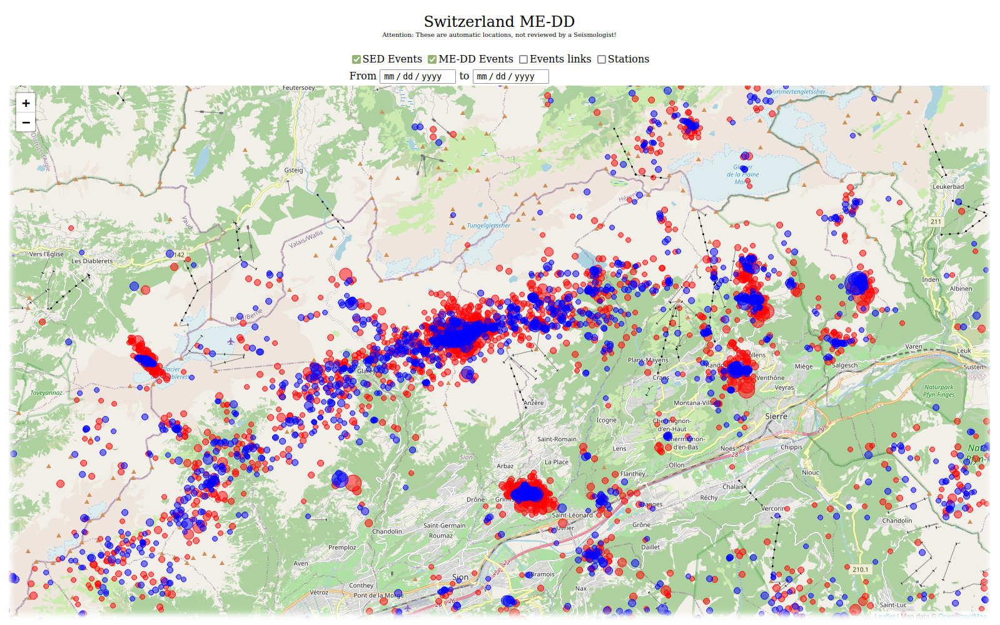
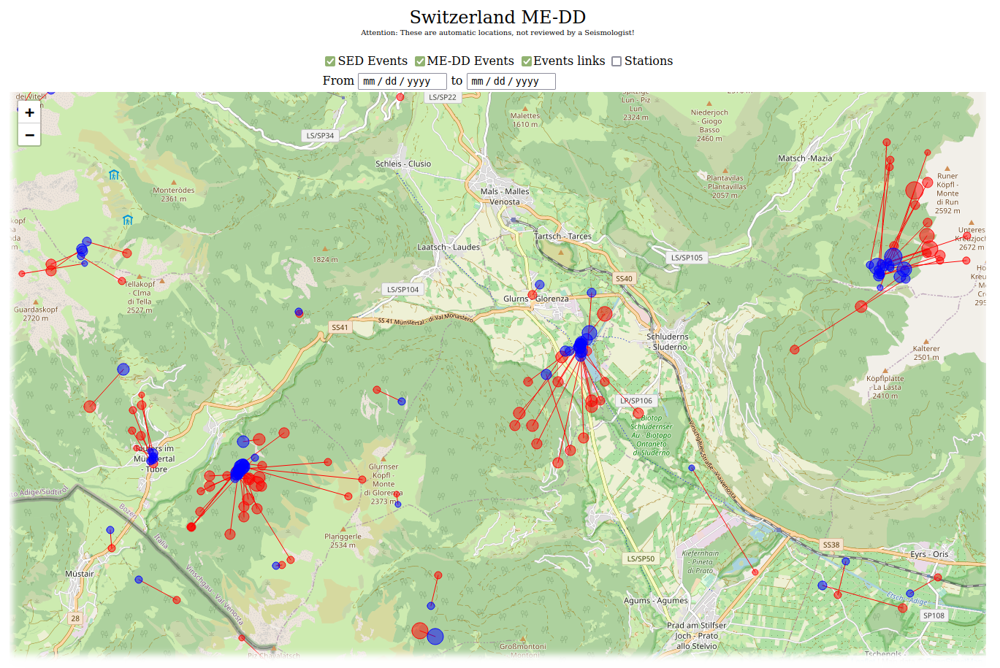
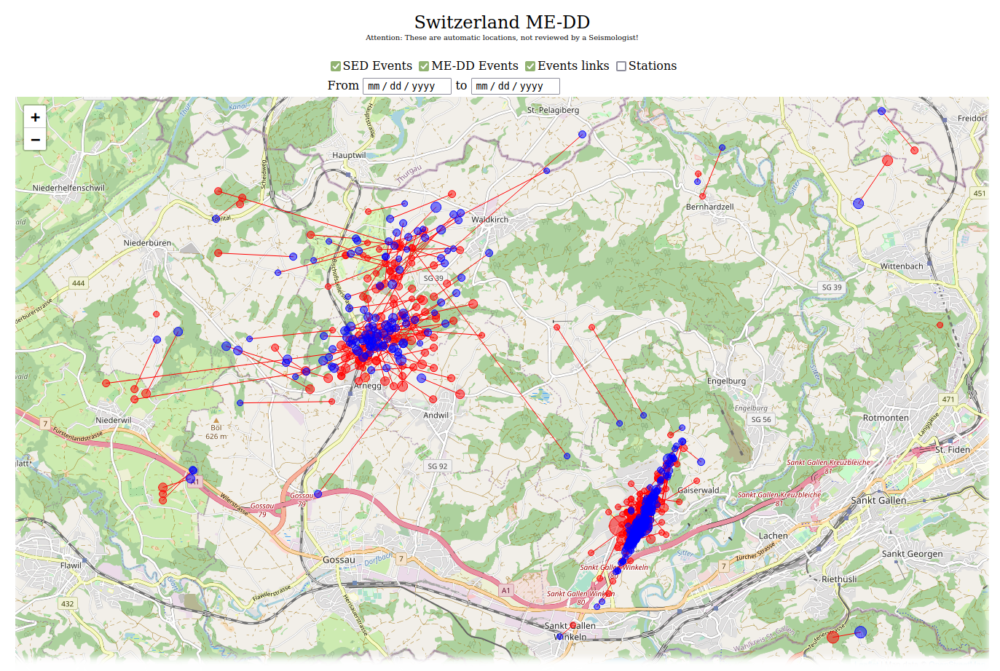
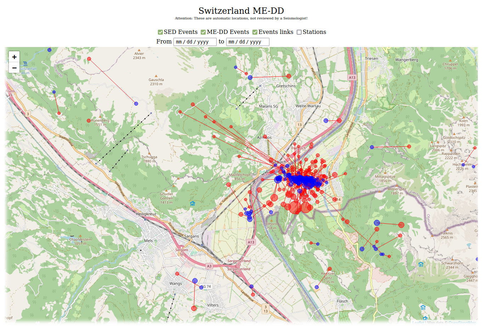
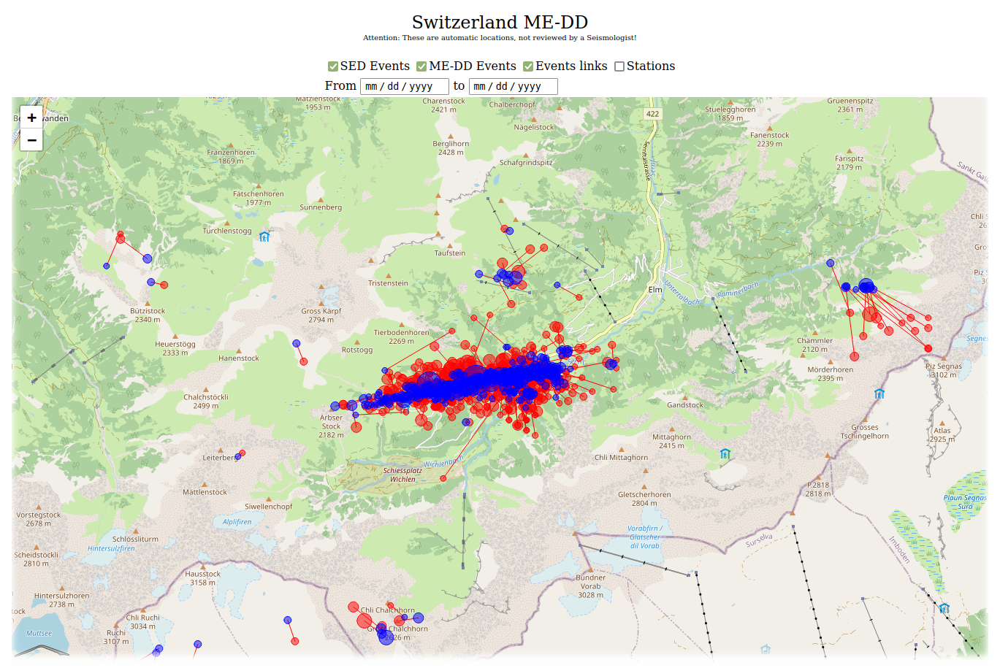

.. _continuous-label:

A continuously updated multi-event relocated catalog
====================================================

Thanks to the integration in SeisComP it is quite easy to use rtDD to periodically generate a double-difference catalog of a region so that recent events are continuously included in the double-difference inversion. This is not only useful for having up-to-date snapshots of high resolution earthquakes locations for a region (multi-event), but it is crucial for real-time double-difference inversion, where new origins are relocated against a reference (background) catalog. Without an up-to-date background catalog the real-time relocations might become inaccurate or even impossible whetere they are attempted in areas without data. This is also especially important when starting monitoring regions where the historical seismicity is not known.

For this reasons it might come in handy the ``generate-background-catalog.sh`` script in `this folder <https://github.com/swiss-seismological-service/scrtdd/tree/master/scripts/>`_, that can be easily adapted to the specific use case and it is useful to periodically generate a multi-event relocated catalog, which can be also displayed in an interactive map, given a web server is available.

