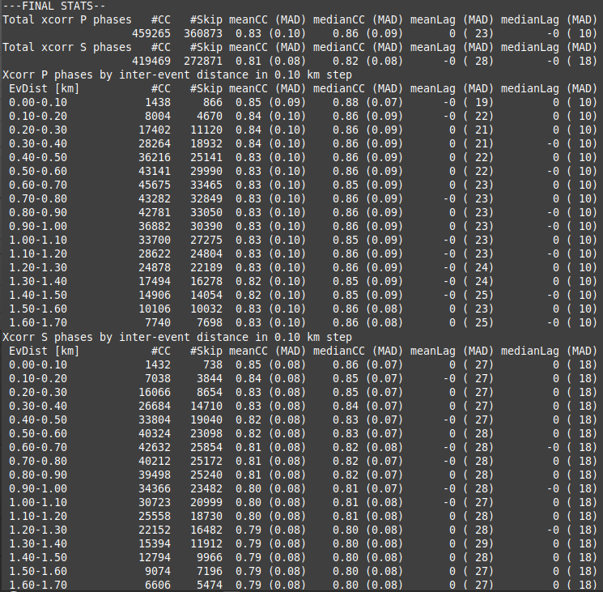
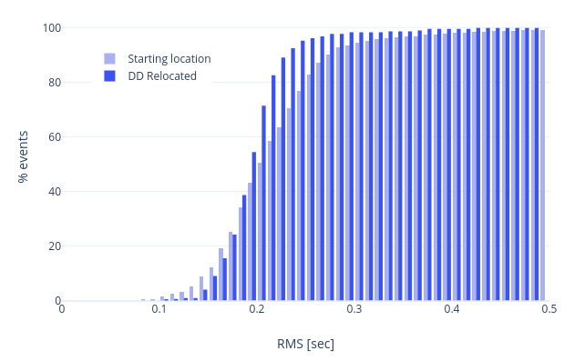

.. _multi-event-label:

Multi-event relocation
======================

Multi-event relocation is used to relocate an event catalog in offline mode.

.. figure:: media/multiEventRelocationSyntDataExample.png
   :width: 800
   
   Test with synthetic data from the unit testing folder. Events from 4 clusters have their locations and times altered - using several normal distributions with non-zero mean - to simulate location/time errors. The multi-event double-difference inversion is then applied on those altered event clusters and their original locations and times are properly recovered. It is interesting to note that the relocation is performed on the 4 clusters together, in a single inversion.

-------
Summary
-------

* Use ``sclistorg`` command to select an event catalog from a SeisComP database.
* Create a rtDD profile (e.g. use ``scconfig`` GUI) which defines the settings for the relocation. The default values provided by rtDD are meant to be a good starting choice, so there is no need to tweak every parameter. However, it is a good choice to configure a custom velocity model.
* Use ``scrtdd --reloc-catalog`` option to relocate the events.
* Use the relocation output (``reloc-event.csv``, ``reloc-phase.csv`` and ``reloc-stations.csv`` or the SCML file ``relocated.xml``) as you please

As an example you may want to have a look at ``multi-event.sh`` script in `this folder <https://github.com/swiss-seismological-service/scrtdd/tree/master/scripts/>`_.

To relocate events not stored in a SeisComP database, refer to :ref:`multi-event-external-data-label`.

--------------
The long story
--------------

To relocate a catalog (multi-event) three pieces of information need to be provided: events data, waveform data and inventory information.

Events data can be provided in three ways:

* A flat file triple ``station.csv,event.csv,phase.csv``, which is explained later.
* A file containing the origin ids of events stored in a SeisComP database. In this case an utility ``sclistorg`` might come in handy to fetch those ids. ``sclistorg`` is distributed with rtDD and it is explained later.
* A file in `SCML format <https://www.seiscomp.de/doc/base/glossary.html#term-SCML>`_, which is a flavor of QuakeML. It is possible to convert between formats with `sccnv command <https://www.seiscomp.de/doc/apps/sccnv.html>`_ .

Waveform data can to be provided in several formats, see :ref:`waveform-label` for more information. The first time you try to relocate a catalog downloading the waveforms might takes some time, but then they are stored in a disk cache that avoids further downloading. Also, If the waveforms are not available (e.g. RecordStream not configured), then rtDD will proceed with the relocation anyway, but without refining the differential times via cross-correlation. 

`Inventory information <https://www.seiscomp.de/doc/base/concepts/inventory.html>`_ can be stored in a SeisComP database or provided via command line (``--inventory-db inventory.xml``). In the latter case the inventory has be in SeisComP own station meta-data XML format called inventory ML (the SeisComP documentation provide information on how to convert from standard formats like FDSN StationXML or dataless SEED). When the events are provided as station.csv,event.csv,phase.csv file triplet, the inventory can be passed as an empty inventory ML.

The multi-event relocation itself consists in running the command ``scrtdd --reloc-catalog [options]`` with appropirate options, discussed later.

The output will be another catalog containing the relocated origins. Depending on the command line options this catalog is stored in plain text files or SCML format (which can be converted to QuakeML).

In multi-event mode there is no interaction with the running SeisComP modules and nothing is writted to the database. It is a safe operation and allow for easy experimentation. However, the SCML output can be stored into the SeisComP database if required. That is optional.

--------------------------------------
Event catalog from SeisComP origin ids
--------------------------------------

There is a tool that is installed alongside rtDD, called ``sclistorg``, that is useful for listing origin ids satisfying certain criteria, such as time period, geographic area, author, agency and so on. E.g.::

    # list the preferred origin ids for all events between 2018-11-27 and 2018-12-14
    sclistorg --begin "2018-11-27 00:00:00" --end "2018-12-14 00:00:00" --org-type preferred [db options]

    # select also the event type and the accepted agencies
    sclistorg --begin "2018-11-27 00:00:00" --end "2018-12-14 00:00:00" --org-type preferred \
              --ev-type "earthquake,quarry blast" --inc-agency Agency1,Agency2 [db options]

    # select an area of interest, a rectangle minLat,minLon,maxLat,maxLon
    sclistorg --begin "2018-11-27 00:00:00" --end "2018-12-14 00:00:00" --org-type preferred \
              --area 46.0,8.5,46.5,8.7 [db options]

See ``sclistorg --help`` for a full list of options.::

    Events:
      --begin arg                   specify the lower bound of the time interval
      --end arg                     specify the upper bound of the time interval
      --modified-after arg          select events modified after the specified time
      --ev-type arg                 include only events whose type is one of the
                                    values provided (comma separated list)
      --simple                      Print only origin ids

    Origins:
      --org-type arg                preferred, last or first (default is preferred)
      --manual-only                 Include only manual origins
      --auto-only                   Inlude only automatic origins
      --inc-author arg              include only origins whose author is one of the
                                    values provided (comma separated list)
      --excl-author arg             exclude origins whose author is one of the
                                    values provided (comma separated list)
      --inc-method arg              include only origins whose methodID is one of
                                    the values provided (comma separated list)
      --excl-method arg             exclue origins whose methodID is one of the
                                    values provided (comma separated list)
      --inc-agency arg              include only origins whose agencyID is one of
                                    the values provided (comma separated list)
      --excl-agency arg             exclude origins whose agencyID is one of the
                                    values provided (comma separated list)
      --area arg                    Include only origins in the rectangular area
                                    provided: MinLat,MinLon,MaxLat,MaxLon

-------------------------
Formats of Events Catalog
-------------------------

The origin ids of the events to be relocated must be stored in a format that rtDD understands.

One of the compatible formats is a text file containing the origin IDs (``sclistorg`` output is compatible with that). rtDD will use the origin IDs in the file to fetch all necessary information from the SeisComP database.

E.g. *file myCatalog.csv* (a mandatory column named ``seiscompId`` is required, but other column might be present too).::

    seiscompId
    Origin/20181214107387.056851.253104
    Origin/20180053105627.031726.697885
    Origin/20190121103332.075405.6234534
    Origin/20190223103327.031726.346363
    [...]

There is another format we can use to store a catalog. This format contains the full origins information, not only the origin ids. So, once the files are generated, there is no need to access the database anymore; so this format is quite fast to load. We can instruct rtDD to generate such a format with the following command::

    scrtdd --dump-catalog myCatalog.csv --verbosity=3 --console=1 [db options]

The above command will generate three files (*event.csv*, *phase.csv* and *stations.csv*) which contain all the information needed by rtDD. 

E.g. *file event.csv* ::

    id,isotime,latitude,longitude,depth,magnitude
    1,2019-11-05T00:54:21.256705Z,46.318264,7.365509,4.7881,3.32
    2,2019-11-05T01:03:06.484287Z,46.320718,7.365435,4.2041,0.64
    3,2019-11-05T01:06:27.140654Z,46.325626,7.356148,3.9756,0.84
    4,2019-11-05T01:12:25.753816Z,46.325012,7.353627,3.7090,0.39

Notes:
* ``magnitude`` column is currently not used
* ``depth`` is in km

E.g. *file station.csv*::

    latitude,longitude,elevation,networkCode,stationCode,locationCode
    45.980278,7.670195,3463.0,4D,MH36,A
    45.978720,7.663000,4003.0,4D,MH48,A
    46.585719,8.383171,2320.4,4D,RA43,
    45.903349,6.885881,2250.0,8D,AMIDI,00
    46.371345,6.873937,379.0,8D,NVL3,

* ``elevation`` is in meter

E.g. *file phase.csv* ::

    eventId,isotime,lowerUncertainty,upperUncertainty,type,networkCode,stationCode,locationCode,channelCode,evalMode
    1,2019-11-05T00:54:22.64478Z,0.025,0.025,Pg,8D,RAW2,,HHZ,automatic
    1,2019-11-05T00:54:23.58254Z,0.100,0.100,Sg,8D,RAW2,,HHT,manual
    1,2019-11-05T00:54:22.7681Z,0.025,0.025,Pg,CH,SAYF2,,HGZ,manual
    1,2019-11-05T00:54:24.007619Z,0.050,0.050,Sg,CH,STSW2,,HGT,manual
    2,2019-11-05T01:03:08.867835Z,0.050,0.050,S,8D,RAW2,,HHT,manual
    2,2019-11-05T01:03:07.977432Z,0.025,0.025,P,CH,SAYF2,,HGZ,manual
    2,2019-11-05T01:03:08.9947Z,0.050,0.050,Sg,CH,SAYF2,,HGT,automatic
    2,2019-11-05T01:03:09.12808Z,0.050,0.050,P,CH,STSW2,,HG1,manual
    2,2019-11-05T01:03:09.409276Z,0.025,0.025,Sg,CH,SENIN,,HHT,automatic

Notes:

* ``type``: mutiple picks are allowed for the same event-station (P,Pn,P1,Pg,S,Sn,S1,Sg), but they must have a different ``type``. However only one P and one S will be used per each event-station (see ``profile.myProfile.catalog.P|S-Phases``).
* ``channelCode``: used only for crossCorrelation, it specifies the channel code to use for fetching the waveform. The Orientation Code of the ``channelCode`` (e.g. ``Z`` in ``HHZ``) can be overridden by the parameter ``profile.myProfile.crossCorrelation.p|s-phase.components``.
* ``lowerUncertainty`` and ``upperUncertainty`` are used only when ``profile.myProfile.solver.aPrioriWeights.usePickUncertainties`` is set to ``true``

With this format it is possible to relocate events that are not stored in any SeisComP database, since all the origins information are contained in those files.

Finally, the events to be relocated can also be stored in SeisComP XML format. Please refer to the official SeisComP  documentation of ``scxmldump``, a very convenient tool for dumping events to XML file.

-------------------------------
Relocating the candidate events
-------------------------------

Before performing the relocation we need to create a new profile in the rtDD configuration where it is possible to select the values for the relocation steps: double-difference system creation, cross-correlation and solver.

.. image:: media/configOverview.png
   :width: 800

The default values provided by rtDD are meant to be a good starting choice, so there is no need to tweak every parameter. However, it is a good choice to configure a custom velocity model (``solver.travelTimeTable``). The cross-correlation parameters are described in a dedicated paragraph. Finally, when the configuration is ready, we can relocate the catalog with the following commands...

Relocating a file containing a list of origin ids
-------------------------------------------------

::

    scrtdd --reloc-catalog myCatalog.csv --profile myProfile \
           --verbosity=3 --console=1 [db options] 

E.g. *file myCatalog.csv*::

    seiscompId
    Origin/20181214107387.056851.253104
    Origin/20180053105627.031726.697885
    [...]

Relocating the station.csv,event.csv,phase.csv triplet
------------------------------------------------------

::

    # station.csv,event.csv,phase.csv are generated with `scrtdd --dump-catalog`
    scrtdd --reloc-catalog station.csv,event.csv,phase.csv --profile myProfile \
           --verbosity=3 --console=1 [db options] 

Relocating a XML/SCML file
--------------------------

Events are stored in a `SCML format <https://www.seiscomp.de/doc/base/glossary.html#term-SCML>`_. It is possible to convert between different formats with `sccnv command <https://www.seiscomp.de/doc/apps/sccnv.html>`_::

    # events.xml contais the events data (scxmldump command)
    # myCatalog.csv contains the origin ids inside events.xml we want relocate
    scrtdd --reloc-catalog myCatalog.csv --ep events.xml --profile myProfile \
           --verbosity=3 --console=1 [db options] 

.. _multi-event-external-data-label:

Relocating external data
------------------------

The easiest way to relocate external (non SeisComP) data is to provide the event catalog in the ``station.csv,event.csv,phase.csv`` file triplet format explained above. Alternatively it can be converted from a standard QuakeML to SeisComP ML using `sccnv command <https://www.seiscomp.de/doc/apps/sccnv.html>`_.
The waveform data can to be provided via ``-I RecordStream`` command line option, which support several formats (see :ref:`waveform-label` for more details).
The inventory can be provided via command line ``--inventory-db inventory.xml``. The inventory has be in SeisComP own format called inventory ML, (the SeisComP documentation provide information on how to convert from standard formats like FDSN StationXML or dataless SEED). When the events are provided as station.csv,event.csv,phase.csv file triplet, the inventory can be passed as an empty inventory ML.

Relocating a catalog in **"station.csv,event.csv,phase.csv"** file triplet format. In this example the data is stored in sds miniseed archive::

    scrtdd --reloc-catalog station.csv,event.csv,phase.csv --profile myProfile \
           -I sdsarchive:///home/sysop/seiscomp/var/lib/archive \
           --inventory-db inventory.xml \
           --verbosity=3 --console=1

The inventory can optionally be empty, which is not an issue if the cross-correlation is not enabled. However when the cross-correlation is used the implication of having an empty invenory is that rtDD doesn't know the orientation of the sensor components and for this reason the special waveform transformations (rotation to the Transversal/Radial component, L2 norm of the horizontal components) become unavailable and should not be selected in ``profile.myProfile.crossCorrelation.p|s-phase.components``. The real componets should be selected instead (e.g. Z, E, N, 1, 2, 3).

This is an **empty inventory**::

    <?xml version="1.0" encoding="UTF-8"?>
    <seiscomp xmlns="http://geofon.gfz-potsdam.de/ns/seiscomp3-schema/0.11" version="0.11">
      <Inventory>
      </Inventory>
    </seiscomp>

Relocating a catalog in **SCML format** (the inventory is always required). The catalog and inventory were downloaded from FDSN and converted to SeisComP ML. The waveform data is fetched from FDSN::

    # myCatalog.csv contains the origin ids inside events.xml we want relocate
    scrtdd --reloc-catalog myCatalog.csv --ep events.xml --profile myProfile \
           -I fdsnws://service.iris.edu:80/fdsnws/dataselect/1/query  \
           --inventory-db inventory.xml \
           --verbosity=3 --console=1

----------------------
Evaluating the results
----------------------

Independently on how the input events are provided, rtDD will output a set of files *reloc-event.csv*, *reloc-phase.csv* and *reloc-stations.csv*, these contain the relocated catalog and additional statistical information.  Also, enabling the ``scrtdd.saveProcessingFiles`` option makes rtDD generates multiple information files inside ``scrtdd.workingDirectory``, including a copy of the log file.

To be good, the new locations must improve the relative locations (the residuals of the double-difference system should have decreased after the inversion), without introducing absolute location errors (the events RMS should not have increased - if that is the case the damping factor was too low) or even improving the absolute locations (if the ``absoluteLocationConstraint`` option was used). We can verify those conditions looking at the logs, where the solver prints, at each iteration, the residuals of the double-difference system and the absolute travel time RMS of the events. 

The *reloc-event.csv* file contains even more detailed information, which allows to plot the distribution of DD residuals and events RMS before and after the catalog relocation (see columns ``startRms``, ``finalRms``, ``dd_startResidualMedian``, ``dd_startResidualMAD``, ``dd_finalResidualMedian``, ``dd_finalResidualMAD`` where MAD is Median Absolute Deviation).

Log files are located in ~/.seiscomp/log/scrtdd.log, or alternatively, when running rtDD from the command line, the following options can be used to see the logs on the console::

    scrtdd [some options] --verbosity=3 --console=1

Verbosity 3 should be preferred to level 4, since the debug level 4 makes the logs hard to read due to the huge amount of information.

A typical *multi-event* relocation log looks like the following::

    [info] Loading profile myProfile
    [info] Profile myProfile loaded into memory
    [info] Starting DD relocator in multiple events mode
    [info] Selecting Catalog Neighbouring Events 
    [info] Searching for not connected clusters...
    [info] Found 3 event clusters
    [info] Relocating cluster 1 (8302 events)
    [info] Computing differential times via cross-correlation...
    [...] 
          ...wait for cross-correlation to complete...
    [...]
    [info] Catalog waveform data: waveforms downloaded 0, not available 273, loaded from disk cache 195652. Waveforms with SNR too low 28811
    [info] Cross-correlation performed 1126058 (P phase 58%, S phase 42%), skipped 631012 (36%)
    [info] Cross-correlation success (coefficient above threshold) 49% (556258/1126058). Successful P 56% (367483/653253). Successful S 40% (188775/472805)
    [info] Building and solving double-difference system...
    [...]
         ...details of the DD residuals and event RMS for each iteration of the solver...
    [...]
    [info] Successfully relocated 8243 events, RMS median 0.3294 [sec] median absolute deviation 0.0558 [sec]
    [info] Events RMS before relocation: median 0.3480 median absolute deviation 0.0637

    [info] Relocating cluster 2 (83 events)
    [...]

    [info] Relocating cluster 3 (1583 events)
    [...] 

Verifying DD system residuals and absolute RMS
----------------------------------------------

The relevant part for the evaluation of the double-difference inversion is the following:

.. image:: media/qc1.png
   :width: 800

We can clearly see how the DD residuals decrease at each iteration and how they are related to the inter-event distance: the close the events the lower the residuals.
Also, the absolute travel time RMS didn't worsen, it slightly improved. That confirms we didn't introduce absolute location errors in the cluster position during the inversion.

Verifying relative locations with cross-correlation
---------------------------------------------------

An independent method to evalute the correctness of the relative locations is to use the cross-correlation results. Since the waveforms similarity is  indicative of the proximity of the events, that information can used to compare the cross-correlation results by inter-event distance before and after the double-difference inversion, see :ref:`xcorr-event-label` (to avoid recomputing cross-correlations pass the `xcorr.csv` file generated by the relocation, see :ref:`reusing-xcorr-label`).
::

    scrtdd --eval-xcorr station.csv,event.csv,phase.csv --profile myProfile --verbosity=3 --console=1 [--xcor-cache xcorr.csv]

::

    scrtdd --eval-xcorr station.csv,reloc-event.csv,phase.csv --profile myProfile --verbosity=3 --console=1 [--xcor-cache xcorr.csv]

Verifying the absolute location of the events
---------------------------------------------

rtDD computes the RMS after (``finalRms`` column in *reloc-event.csv* file) but also before (``startRms`` column in *reloc-event.csv* file) the relocation. The computation of the initial RMS is required for a sensible comparison of RMSs. Each locator (scautoloc, scanloc, screloc, nonlinloc, scrtdd, etc) computes the RMS with a travel time table that might not be the same as rtDD. Moreover, a locator might apply a specific logic to the RMS computation, which prevents a comparison across locators. For example NonLinLoc locator weighs the residuals by pick weight, and the weighting scheme is decided by NonLinLoc, making the resulting RMS unsuitable for comparison.

Plotting ``startRms`` and ``finalRms`` allows for a sensible comparison of the absolute location of the relocated cluster(s).

--------------
Useful options
--------------

In addition to the options we have already seen, there are also some other useful ones.

``--xmlout`` option can be used in combination with ``--reloc-catalog`` to generate a XML output, which is useful to later insert the relocated catalog in a SeisComP database (e.g. scdb command).

E.g.::

    scrtdd --reloc-catalog myCatalog.csv --profile myProfile \
           --verbosity=3 --console=1 [db options]
           --xmlout > relocated-catalog.xml

``--merge-catalogs`` and ``--merge-catalogs-keepid`` are useful to merge several catalogs into a single one. 

::

    scrtdd --merge-catalogs station1.csv,event1.csv,phase1.csv,station2.csv,event2.csv,phase2.csv

``--xcorr-cache`` option allows to reuse precomputed cross-correlations, see :ref:`reusing-xcorr-label`.

``--dump-clusters`` option allows to dump the catalog clusters that rtDD finds accordingly with the profile options.

Here is a list of all the options we have seen so far::
    
    scrtdd --help

    Mode:

      --reloc-catalog arg                   Relocate the catalog passed as argument
                                            in multi-event mode. The input can be a
                                            single file (containing seiscomp origin
                                            ids) or a file triplet 
                                            (station.csv,event.csv,phase.csv). For 
                                            events stored in a XML files add the 
                                            --ep option. Use in combination with 
                                            --profile

      --ep arg                              Event parameters XML file for offline 
                                            processing of contained origins 
                                            (implies --test option). Each contained
                                            origin will be processed in 
                                            signle-event mode unless 
                                            --reloc-catalog is provided, which 
                                            enable multi-event mode.

      --dump-clusters arg                   Find clusters in the catalog passed as 
                                            argument and save them in the working 
                                            directory.The catalog can be a single 
                                            file (containing seiscomp origin ids) 
                                            or a file triplet (station.csv,event.cs
                                            v,phase.csv). Use in combination with 
                                            --profile. The clusters will be saved 
                                            into the working directory

    ModeOptions:

      --profile arg                         To be used in combination with other 
                                            options: select the profile 
                                            configuration to use

      --xcorr-cache arg                     Specify a file containing precomputed 
                                            cross-correlation values

      --xmlout                              Enable XML output when combined with 
                                            --reloc-catalog or --oring-id options 

    Catalog:

      --dump-catalog arg                    Dump the seiscomp event/origin id file 
                                            passed as argument into a catalog file 
                                            triplet (station.csv,event.csv,phase.cs
                                            v).

      --merge-catalogs arg                  Merge in a single catalog all the 
                                            catalog file triplets 
                                            (station1.csv,event1.csv,phase1.csv,sta
                                            tion2.csv,event2.csv,phase2.csv,...) 
                                            passed as arguments.

      --merge-catalogs-keepid arg           Similar to the --merge-catalogs option 
                                            but events keep their ids. If multiple 
                                            events share the same id, subsequent 
                                            events will be discarded.

