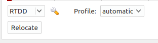

.. _plugin-label:

Scolv Locator plugin
====================

A locator plugin is also available in the code, which makes rtDD available via ``scolv``. To enable this plugin just add ``rtddloc`` to the list of plugins in the global configuration.

Please note that this plugin is not strictly required since rtDD would relocated any manual origins anyway (if configured to do so) and the relocated origin will appear on ``scolv`` as soon as ready.

Also ``scolv`` doesn't allow to create new picks when performing a relocation, so rtDD plugin disable the cross-correlation on theoretical picks since those picks will not be reported on ``scolv``.
