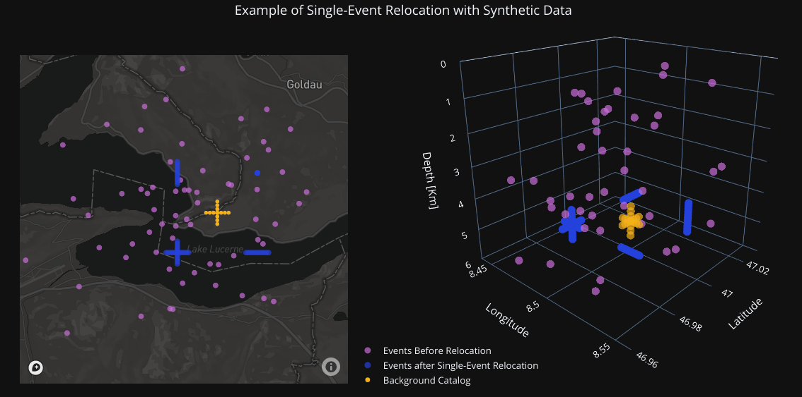
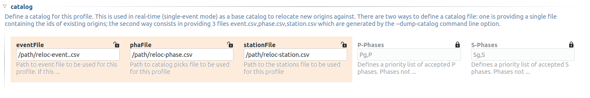
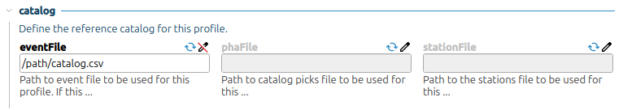

.. _single-event-label:

Real-time single-event relocation
=================================

Single-event relocation is used to relocate events in real-time and it requires a background catalog to work.

   
   Test with synthetic data from the unit testing folder. Events from 4 clusters have their locations and times altered - using several normal distributions with non-zero mean - to simulate location/time errors. The single-event double-difference inversion is then applied on those altered events, one at a time against the background catalog and their original locations and times are properly recovered. It is interesting to note that the backgroud catalog is not part of the 4 clusters, but the double-differene inversion is still able to perfectly recover the event locations of those close-by clusters.

-------
Summary
-------

* Use the multi-event relocation feature to prepare a background catalog
* Create a rtDD profile or use the same profile used for generating the background catalog
* Set the background catalog in the profile and add the profile to the list of active real-time profiles (``activeProfiles`` parameter). The default profile parameter values are meant to be a good starting choice, so there is no need to tweak them heavily. However, it is a good choice to configure a custom velocity model (``solver.travelTimeTable``)
* Make sure to read :ref:`avoid-loop-label` paragraph to avoid a potential issue
* Make sure to read :ref:`waveform-label` paragraph to avoid delays when fetching data from seedlink
* Enable and start rtDD (``seiscomp enable scrtdd``, ``seiscomp start scrtdd``)

---------------
Getting started
---------------

In single-event mode, rtDD relocates new seismic events in real-time, one a time, against a background catalog of high quality events. This reference catalog consists in the historic seismicity of a certain area that have been relocated with the double-difference inversion. That can be done with rtDD itself in Multi-Event mode or by means of other tools.

The real-time relocation is performed in two steps. The first step refines the location of a newly occurred event by building and solving a double-difference system, where the observed differential travel times are derived from the pick times. The cross-correlation is not used in this first step. The second step starts from the location refined at step 1, then a new double-difference system is built and solved. This time the observed differential times are refined via cross-correlation. If step1 fails, step2 is attempted anyway. If step2 completes successfully the relocated origin is sent to the messaging system.

At each step a selection of neighbouring events from the background catalog takes place. The selected events are paired with the real-time event to form the double-difference system.  In the simplest form the selection can be nearest neighbour based, where the closest events are chosen within a configurable maximum search distance. However, to handle initial location errors in which the real-time event would be paired with events that are not close to its true location, the neighbour selection is performed using the ellipsoid method explained in Waldhauser's paper "Near-Real-Time Double-Difference Event Location Using Long-Term Seismic Archives, with Application to Northern California". In this variant concentric elliptic volumes are created and subsequently divided in their eight quadrants. The neighbours are finally selected from each of these cells in a round robin fashion until the configured maximum number of neighbours is reached. This approach spreads the selection of event pairs over a larger area, that should cover the initial location uncertainty.

--------------------------------
Configuring a background catalog
--------------------------------

The easiest choice is to use as background catalog the relocated multi-event results; the triplet *reloc-event.csv*, *phase.csv*, *station.csv*:

However, if the catalog is generated in XML format, it can be imported in the SeisComP database. In this case the background catalog can be a file containing just the origin ids. 

While it is neat to have the background catalog in the SeisComP database, this approach has few limitations. Firstly it may take a lot of time for rtDD to load a big catalog from the database; loading a catalog from files is much faster. Secondly, the background catalog should be periodically updated and this update produces not only new events, but also new locations for old events. In turn this leads to a continuous addition of origins belonging to old events to the database.

Once the background catalog is configured, rtDD can be enabled and started as any other SeisComP module.  New origins will be relocated as soon as they arrive in the messaging system.

-------
Testing
-------

You might consider testing the configuration relocating some existing events to make sure the parameters are suitable for your use case. To test the real time relocation there are two command line options which relocate existing origins::

    scrtdd --help

    Mode:

      -O [ --origin-id ] arg                Relocate  the origin (or multiple 
                                            comma-separated origins) in 
                                            signle-event mode and send a message. 
                                            Each origin will be processed 
                                            accordingly to the matching profile 
                                            region unless the --profile option  is 
                                            used.
      --ep arg                              Event parameters XML file for offline 
                                            processing of contained origins 
                                            (implies --test option). Each contained
                                            origin will be processed in 
                                            signle-event mode unless 
                                            --reloc-catalog is provided, which 
                                            enable multi-event mode.

    ModeOptions:

       --profile arg                        To be used in combination with other 
                                            options: select the profile 
                                            configuration to use

      --test                                Test mode, no messages are sent when 
                                            relocating a single event

      --xmlout                              Enable XML output when combined with 
                                            --reloc-catalog or --oring-id options

Relocate origin ID and send the relocation to the messaging system for further processing
-----------------------------------------------------------------------------------------

If we want to process an origin we can run the following command and then check on ``scolv`` the relocated origin (the messaging system must be active). This is mostly useful when we want to relocate an origin on a running system and keep the relocation::

    scrtdd --origin-id someOriginId \
           --verbosity=3 --console=1 [db options] 

Relocate origin ID but do not send the relocation (debug)
---------------------------------------------------------

As above but add ``--test`` and the origin will not be sent to the messaging system. Useful for troubleshooting when the ``scrtdd.saveProcessingFiles`` option is enabled to verify the relocation files in ``scrtdd.workingDirectory``.
::

    scrtdd --origin-id someOriginId --test \
           --verbosity=3 --console=1 [db options]

Relocate origin ID and store the result to XML file
---------------------------------------------------

Adding the ``--xmlout`` option allows to save the origin as a XML file. We can finally open the ile with ``scolv`` for inspection::

    scrtdd --origin-id someOriginId --xmlout \
           --verbosity=3 --console=1 [db options] \
      >  relocated-origin.xml

Relocate XML file and store the result to XML file
--------------------------------------------------

Similarly to other SeisComP commands the ``--ep`` option can be used for full offline processing. All origins contained in the input XML file are relocated::

    scrtdd --ep origin.xml --verbosity=3 --console=1 [db options] \
      > relocated-origin.xml

Relocation log
--------------

Here we report an example *single-event* relocation log::

    [info] Starting DD relocator in single event mode: event 1 lat 46.419079 lon 7.942911 depth 8.9902 mag 0.56 time 2020-10-31T19:46:57.703383Z #phases 22
    [info] Performing step 1: initial location refinement (no cross-correlation)
    [info] Found 22 neighbouring events
    [info] Building and solving double-difference system...
    [...]
         ...details of the solutions for each iteration of the solver
    [...]
    [info] Successfully relocated 1 events, RMS median 0.2865 [sec] median absolute deviation 0.0000 [sec]
    [info] Events RMS before relocation: median 0.3309 median absolute deviation 0.0000
    [info] Step 1 relocation successful, new location: lat 46.419460 lon 7.932872 depth 8.9892 time 2020-10-31T19:46:57.770484Z
    [info] Relocation report: 
           Origin changes: location=0.77[km] depth=-0.00[km] time=0.067[sec] 
           Rms change [sec]: -0.044 (before/after 0.331/0.287) 
           Neighbours=22 
           Used Phases: P=9 S=6 
           Stations distance [km]: min=16.6 median=25.6 max=61.9 
           DD observations: 143 (CC P/S 0/0 TT P/S 88/55) 
           DD residuals [msec]: before=40+/-59.4 after=-4+/-4.9
    
    [info] Performing step 2: relocation with cross-correlation
    [info] Found 30 neighbouring events
    [info] Computing differential times via cross-correlation...
    [info] Cross-correlation performed 101 (P phase 50%, S phase 50%), skipped 89 (47%)
    [info] Cross-correlation success (coefficient above threshold) 73% (74/101). Successful P 86% (44/51). Successful S 60% (30/50)
    [info] Building and solving double-difference system...
    [...]
         ...details of the solutions for each iteration of the solver
    [...]    
    [info] Successfully relocated 1 events, RMS median 0.2834 [sec] median absolute deviation 0.0000 [sec]
    [info] Events RMS before relocation: median 0.2642 median absolute deviation 0.0000
    [info] Step 2 relocation successful, new location: lat 46.418945 lon 7.932328 depth 8.6810 time 2020-10-31T19:46:57.808104Z
    [info] Relocation report:
           Origin changes: location=0.07[km] depth=-0.31[km] time=0.038[sec] 
           Rms change [sec]: 0.019 (before/after 0.264/0.283) 
           Neighbours=30 
           Used Phases: P=9 S=6 
           Stations distance [km]: min=16.4 median=25.4 max=61.7 
           DD observations: 190 (CC P/S 44/30 TT P/S 72/44) 
           DD residuals [msec]: before=40+/-59.4 after=-5+/-6.5

rtDD adds two comments to each relocated origin: ``relocation::sourceOrigin`` and ``relocation::report``. 

``relocation::sourceOrigin`` contains the id of the origin that triggered the relocation. ``relocation::report`` contains a summary of the relocation process. E.g.::

    Origin changes: location=0.23[km] depth=1.40[km] time=-0.147[sec]
    Rms change [sec]: -0.153 (before/after 0.502/0.349)
    Neighbours=80 Used Phases: P=37 S=16
    Stations distance [km]: min=15.9 median=57.0 max=99.8
    DD observations: 687 (CC P/S 141/47 TT P/S 375/124)
    DD residuals [msec]: before=-106+/-21.6 after=9+/-26.2

They can be both visualized in ``scolv`` as additional columns adding the following settings to ``scolv.cfg``::

    # SCRTDD: display source origin that generated a scrtdd relocation
    eventlist.customColumn.default = ""
    eventlist.customColumn.originCommentID = relocation::sourceOrigin
    eventlist.customColumn = triggeringOrigin
    
    # SCRTDD: display origin comment containing rtdd relocation report
    eventedit.customColumn.default = ""
    eventedit.customColumn.originCommentID = relocation::report
    eventedit.customColumn.pos = 99
    eventedit.customColumn = scrtd

.. _phase-update-label:

-----------------------------------------------------
Pick update and Phase detection via cross-correlation
-----------------------------------------------------

rtDD uses cross-correlation to fix the pick time and uncertainty of automatic picks. The pick time is updated according to the average lag detected by all the good (above configured threshold) cross-correlation results. Since the real-time events are cross-correlated against catalog events, which have good manual picks, the updated pick time is expected to improve. The pick uncertainty is derived from the uncertainties of catalog events. If no cross-correlation result is above the configured threshold, the automatic pick is kept untouched.

rtDD can also make use of cross-correlation to detect phases at stations where an origin has no associated picks (see ``crossCorrelation.detectMissingPhasesAutoOrigin`` and ``crossCorrelation.detectMissingPhasesManualOrigin``). During the differential times computation step, every origin phase is cross-correlated against the neighbouring event phases. When a neighbour has a phase at a station for which the real-time origin does not, rtDD computes the theoretical pick time for the station and cross-correlates it against the reference event phases. If the correlation coefficient is above the configured threshold a new phase is created and used in the inversion. Theoretical picks that have no good cross-correlation results are simply discarded.

Picks that have been updated or created by rtDD are identifiable by a ``x`` suffix (Px, Sx).

Manual picks are never modified.

.. _avoid-loop-label:

-------------------------
Avoiding Relocation Loops
-------------------------

rtDD listens and sends messages to the LOCATION group. In a default installation where the only locator is ``scautoloc`` that's not an issue: ``scautoloc`` will send an origin to LOCATION and rtDD will receive it and send an updated origin to LOCATION.  However, when there are multiple (re)locators (e.g. scanloc, screloc) that listen to LOCATION and send their own updated origin to LOCATION too, then an infinite loop happens! In this case a new messaging group needs to be created, e.g. RELOCATION, so that the origins flow from LOCATION to RELOCATION without going back.

 E.g. of a properly configured system::

                          LISTEN                       SEND 
                  (MessagingSubscription)      (PrimaryMessagingGroup)
    scautoloc             ...                        LOCATION
    scanloc       LOCATION, ...                      LOCATION
    screloc       LOCATION, ...                     RELOCATION
    scrtdd        LOCATION, ...                     RELOCATION
    scevent       LOCATION,RELOCATION, ...             ...
    scamp         LOCATION,RELOCATION, ...             ...
    scmag         LOCATION,RELOCATION, ...             ...

------------------
Relocation Process
------------------

In Single-Event mode the double-difference system is slightly modified compared to the :ref:`Multi-Event version <multi-event-relocation-process-label>`. This is because we are only interested in computing the changes of the real-time event with respect to the background catalog and not so much in the changes on the reference events that the new event might introduce. The reason is the difficulty in avoiding errors in the background catalog when the update happens automatically. Since the background catalog is never changed during the Single-Event relocation, the double-difference equation used to build the double-difference system becomes:

.. math:: \frac{\partial t_k^i}{\partial m} \Delta m^i = dr_k^{ij}

compared to the multi-event version, the equation lose the :math:`- \frac{\partial t_k^j}{\partial m} \Delta m^j` part. This new formulation computes the changes (lat, lon, depth, time) of a real-time event i with respect to the background catalog event j. The real-time event relocation becomes then the computation of the relative position of a new event to a set of fixed reference events, which dismisses the problem of a possible shift in absolute location during the inversion. Problem :ref:`that exists in the multi-event mode <absolute-plus-relative-label>`. As a result the damping factor :math:`\lambda` can be set to a very low value or event 0. Also the constraint in absolute travel time residuals :math:`\omega` (:ref:`inclusion-tt-residual-label`) can be set to zero.

It should be clear now the importance of having a background catalog with good absolute locations, not only relative, since the quality of the background catalog directly transfers to real-time relocations. Moreover, because the background catalog events are not updated by the Single-Event inversion, a periodic update of the reference catalog that includes the new events is required. This contribution might be negligible for well established clusters, but it is of a crucial importance for regions where the historicial seismicity contains very few events and it is susceptible to considerable changes. Thanks to its integration into SeisComP, rtDD allows for easy and automatic periodic background catalog updates, which should be taken into consideration when applying the tool in real-time. See :ref:`continuous-label`.

