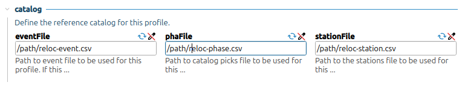

.. _single-event-label:

Real-Time Single-Event Relocation
=================================

Single-event relocation is used to relocate events in real-time and requires a reference catalog to function.

.. figure:: media/singleEventRelocationSyntDataExample.png
   :width: 800
   
   Relocation test using synthetic data. Events from four clusters had their locations and times altered to simulate errors. The single-event double-difference inversion was then applied to these events one at a time against the reference catalog, and their original locations and times were properly recovered. Notably, even though the reference catalog events are not part of these four clusters, the double-difference inversion is still able to accurately recover the locations of these nearby clusters.

-------
Summary
-------

* Use the multi-event relocation feature to prepare a reference catalog.
* Create a ``scrtdd`` profile or reuse the one used for generating the reference catalog.
* Set the reference catalog in the profile and add the profile to the list of active real-time profiles (``activeProfiles`` parameter).
* Read the :ref:`avoid-loop-label` section to avoid potential messaging loops.
* Read the :ref:`waveform-label` section to prevent delays when fetching data from SeedLink by setting ``timeout` and ``retries`` parameters.
* Enable and start ``scrtdd``

---------------
Getting Started
---------------

In single-event mode, ``scrtdd`` relocates new seismic events in real-time, one at a time, against a reference catalog of high-quality events. This reference catalog consists of historical seismicity for a specific area that has been relocated using double-difference inversion. This can be achieved with ``scrtdd`` in Multi-Event mode or through other tools.

Real-time relocation is performed in two steps:

1. **Step 1:** Refines the location of a new event by building and solving a double-difference system where observed differential travel times are derived from pick times. Cross-correlation is not used in this step.
2. **Step 2:** Starts from the refined location from Step 1 and builds a new double-difference system. This time, differential times are refined via cross-correlation.

If Step 1 fails, Step 2 is attempted regardless. If Step 2 completes successfully, the relocated origin is sent to the messaging system.

At each step, neighboring events are selected from the reference catalog. These events are paired with the real-time event to form the double-difference system. While selection can be based on a simple nearest-neighbor search within a maximum distance, ``scrtdd`` uses an ellipsoid method to account for initial location errors. This method, described by Waldhauser (2009), creates concentric elliptic volumes divided into eight quadrants. Neighbors are selected from each quadrant in a round-robin fashion until the maximum number of neighbors is reached, ensuring a spatially distributed selection that covers the initial location uncertainty.

--------------------------------
Configuring a Reference Catalog
--------------------------------

The most common choice for a reference catalog is the result of a multi-event relocation: the triplet ``reloc-event.csv``, ``reloc-phase.csv`` (or the input ``phase.csv``), and ``reloc-station.csv`` (or the input ``station.csv``).

Alternatively, if the catalog is generated in XML format and imported into the SeisComP database, the reference catalog can be a file containing only origin IDs.

.. image:: media/catalog-selection1.png
   :width: 800

While storing the reference catalog in the SeisComP database is possible, it has limitations. Loading a large catalog from the database can be significantly slower than loading from CSV files. Additionally, since reference catalogs should be updated periodically, database storage can lead to a proliferation of origin versions for older events.

Once the reference catalog is configured, ``scrtdd`` can be enabled and started. New origins will be relocated as they are received via the messaging system.

-------
Testing
-------

It is recommended to test the configuration by relocating existing events to ensure parameters are suitable for your use case. 

Relocate an Origin ID without sending messages
----------------------------------------------

Using the ``--test`` flag prevents the relocation from being sent to the messaging system. This is useful for troubleshooting::

    scrtdd --origin-id someOriginId --test --dump-diagnostics \
           --verbosity=3 --console=1 [db options]

Relocate an Origin ID and save to an XML file
---------------------------------------------

Use ``--xmlout`` to save the result to an XML file for inspection in ``scolv``::

    scrtdd --origin-id someOriginId --xmlout --dump-diagnostics \
           --verbosity=3 --console=1 [db options] \
      > relocated-origin.xml

Relocate an XML file and save the result to an XML file
-------------------------------------------------------

The ``--ep`` option allows for full offline processing of all origins within an XML file::

    scrtdd --ep origin.xml --verbosity=3 --console=1 [db options] \
      > relocated-origin.xml

.. _avoid-loop-label:

-------------------------
Avoiding Relocation Loops
-------------------------

``scrtdd`` listens and sends messages to the ``LOCATION`` group. In a default installation where ``scautoloc`` is the only locator, this is not an issue: ``scautoloc`` sends an origin to ``LOCATION``, and ``scrtdd`` receives it and sends an updated origin back to ``LOCATION``. However, if other relocators (e.g., ``scanloc``, ``screloc``) also listen and send to ``LOCATION``, an infinite loop will occur.

To avoid this, the ``acceptedOriginAuthors`` option can be used, so that ``scrtdd`` will relocate only origins coming from a specific module (author).

An alternative solution is to create a separate messaging group (e.g., ``RELOCATION``) so that origins flow linearly without cycling back.

Example of a properly configured system::

                          LISTEN                       SEND 
                  (MessagingSubscription)      (PrimaryMessagingGroup)
    scautoloc             ...                        LOCATION
    scanloc       LOCATION, ...                      LOCATION
    screloc       LOCATION, ...                     RELOCATION
    scrtdd        LOCATION, ...                     RELOCATION
    scevent       LOCATION,RELOCATION, ...             ...
    scamp         LOCATION,RELOCATION, ...             ...
    scmag         LOCATION,RELOCATION, ...             ...

------------------
Relocation Process
------------------

In Single-Event mode, the double-difference system is slightly modified compared to the :ref:`Multi-Event version <multi-event-relocation-process-label>`. In this mode, we focus exclusively on computing the changes to the real-time event relative to the reference catalog, rather than allowing the reference events to move. 

Because the reference catalog remains fixed during Single-Event relocation, the equation used to build the system simplifies to:

.. math:: \frac{\partial t_k^i}{\partial m} \Delta m^i = dr_k^{ij}

Compared to the multi-event version, this formulation omits the term :math:`- \frac{\partial t_k^j}{\partial m} \Delta m^j`. This new formulation computes the hypocenter changes of a real-time event i with respect to the fixed reference catalog event j. This approach treats the reference events as high-precision "anchors", which are not relocated. It eliminates the risk of cluster centroid shifts during the inversion, a concern in :ref:`multi-event mode <absolute-plus-relative-label>`.

This highlights the critical importance of a high-quality reference catalog with accurate absolute locations, as any errors in the reference events will directly impact the real-time relocations. Furthermore, since reference events are not updated during single-event inversions, the catalog should be periodically updated to incorporate new events. This is particularly vital in regions with sparse historical seismicity. rtDD facilitates this through easy integration for periodic catalog updates. See :ref:`continuous-label`.

