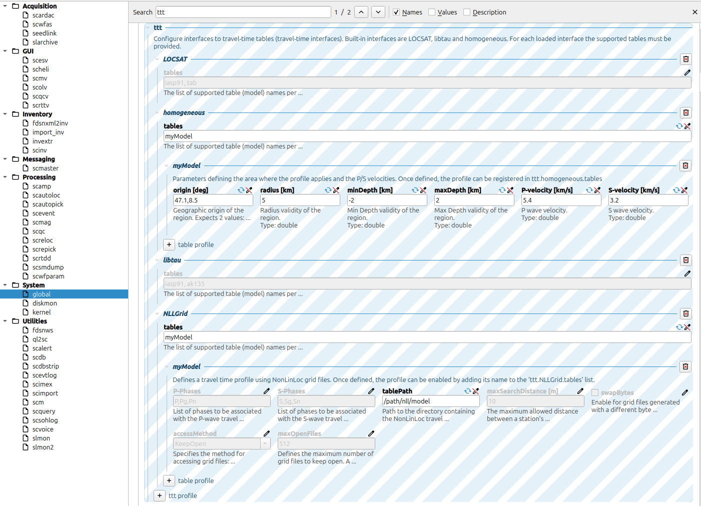

.. _ttt-label:

Custom Velocity Models
======================

``scrtdd`` supports all travel time table formats provided by SeisComP. Additionally, it includes a plugin, ``NLLGrid``, which adds support for NonLinLoc Grid files.

You can configure the velocity model in the ``global`` configuration and select the appropriate format and model within your ``scrtdd`` profile.

``homogeneous`` is suitable for very local seismicity as it supports 3D geometry, accounting for station elevation and negative event depth.

``LOCSAT`` supports 1D velocity models and arbitrary phase types. However, it does not account for station elevation or negative event depths, making it unsuitable for local seismicity. ``libtau`` is similar to ``LOCSAT`` but does not support custom velocity models.

``NLLGrid`` supports 1D and 3D velocity models as well as 3D geometry (station elevation and negative event depth). However, it is limited to first-arriving phases.

NLLGrid
-------

Please refer to the `NonLinLoc documentation <http://alomax.free.fr/nlloc/>`_ by Anthony Lomax for instructions on generating grid files. Once generated, you can configure the ``NLLGrid`` plugin to use them in any SeisComP module.

To enable the plugin, add ``tttnll`` to the list of loaded plugins in ``global.cfg`` or your module configuration.

Using ``scconfig``, navigate to ``global -> ttt`` and add a new TTT profile named ``NLLGrid``.

You can now register ``NLLGrid`` tables (e.g., ``myModel``) and use them in any SeisComP module that supports the SeisComP TTT interface.

The plugin operates as follows: there is no direct mapping between station identifiers (network, station, location) and grid file names (unlike the NonLinLoc locator plugin). Instead, the plugin identifies a grid file that matches the station location defined in the inventory.

This behavior aligns with the standard SeisComP TTT interface. Modules query travel times by providing event coordinates (latitude, longitude, depth) and station coordinates (latitude, longitude, elevation). The grid header contains the station location for which the grid was computed, and the ``NLLGrid`` plugin selects the grid file whose header coordinates correspond to the requested station location.

Since grid headers store station locations in grid-relative coordinates, a projection is required to convert them to geographic coordinates (latitude/longitude), which may introduce small numerical errors. To account for this, the ``NLLGrid`` plugin allows for a configurable tolerance (``maxSearchDistance``) between the inventory station location and the projected grid location.

LOCSAT
------

You can generate custom travel time tables in ``LOCSAT`` format using the `TauP toolkit <https://www.seis.sc.edu/taup>`_. Please refer to the official TauP documentation for the most up-to-date information. The following is a brief guide.

First, ensure you have a velocity model in a format supported by ``TauP`` (``.tvel`` or ``.nd``). The toolkit includes standard models that can serve as references. SeisComP also provides ``iasp91`` and ``ak135`` models in ``seiscomp_installation/share/ttt/``.

Typically, users define specific shallow layers and inherit the deeper structure from an existing model (e.g., ``iasp91``). To do this, create a file (e.g., ``mymodel.tvel``) defining the shallow layers and merge it with a standard model::

    ./TauP-installation/bin/taup velmerge -mod iasp91 -tvelmerge mymodel.tvel

This command generates the ``iasp91_mymodel.nd`` file used in subsequent steps.

Next, define the resolution (depth and distance ranges) for the travel time tables. TauP's default sampling is often too coarse. Create a header file specifying the desired sampling points.

E.g. file ``mymodel.header`` ::

        n # P,S travel-time table sampling for mymodel
    20     # number of depth samples
       0.00   2.50   5.00   7.50  10.00  15.00  20.00  25.00  30.00  40.00
      50.00  75.00 100.00 150.00 200.00 300.00 400.00 500.00 600.00 800.00
    140    # number of distances
       0.00   0.05   0.10   0.15   0.20   0.25   0.30   0.35   0.40   0.45
       0.50   0.60   0.70   0.80   0.90   1.00   1.10   1.20   1.30   1.40
       1.50   1.60   1.70   1.80   1.90   2.00   2.50   3.00   4.00   5.00
       5.50   6.00   6.50   7.00   7.50   8.00   8.50   9.00   9.50  10.00
      11.00  12.00  13.00  14.00  15.00  16.00  17.00  18.00  19.00  20.00
      21.00  22.00  23.00  24.00  25.00  26.00  27.00  28.00  29.00  30.00
      31.00  32.00  33.00  34.00  35.00  36.00  37.00  38.00  39.00  40.00
      41.00  42.00  43.00  44.00  45.00  46.00  47.00  48.00  49.00  50.00
      51.00  52.00  53.00  54.00  55.00  56.00  57.00  58.00  59.00  60.00
      61.00  62.00  63.00  64.00  65.00  66.00  67.00  68.00  69.00  70.00
      71.00  72.00  73.00  74.00  75.00  76.00  77.00  78.00  79.00  80.00
      81.00  82.00  83.00  84.00  85.00  86.00  87.00  88.00  89.00  90.00
      91.00  92.00  93.00  94.00  95.00  96.00  97.00  98.00  99.00 100.00
     102.00 104.00 106.00 108.00 110.00 112.00 114.00 116.00 118.00 120.00

Finally, generate the travel time tables using the following commands::

    ./TauP-installation/bin/taup_table -mod iasp91_mymodel -ph ttp+ -locsat -header mymodel.header -o mymodel.P
    ./TauP-installation/bin/taup_table -mod iasp91_mymodel -ph tts+ -locsat -header mymodel.header -o mymodel.S
    ./TauP-installation/bin/taup_table -mod iasp91_mymodel -ph PcP  -locsat -header mymodel.header -o mymodel.PcP
    ./TauP-installation/bin/taup_table -mod iasp91_mymodel -ph Pg   -locsat -header mymodel.header -o mymodel.Pg
    ./TauP-installation/bin/taup_table -mod iasp91_mymodel -ph Pn   -locsat -header mymodel.header -o mymodel.Pn
    ./TauP-installation/bin/taup_table -mod iasp91_mymodel -ph pP   -locsat -header mymodel.header -o mymodel.pP
    ./TauP-installation/bin/taup_table -mod iasp91_mymodel -ph PP   -locsat -header mymodel.header -o mymodel.PP
    ./TauP-installation/bin/taup_table -mod iasp91_mymodel -ph pS   -locsat -header mymodel.header -o mymodel.pS
    ./TauP-installation/bin/taup_table -mod iasp91_mymodel -ph ScP  -locsat -header mymodel.header -o mymodel.ScP
    ./TauP-installation/bin/taup_table -mod iasp91_mymodel -ph Sg   -locsat -header mymodel.header -o mymodel.Sg
    ./TauP-installation/bin/taup_table -mod iasp91_mymodel -ph Sn   -locsat -header mymodel.header -o mymodel.Sn
    ./TauP-installation/bin/taup_table -mod iasp91_mymodel -ph sP   -locsat -header mymodel.header -o mymodel.sP

The final step is to copy the travel time tables to the SeisComP installation folder so that all modules can access the new model::

    cp mymodel* seiscomp_installation/share/locsat/tables/
