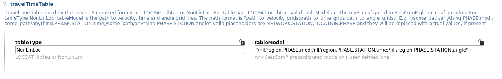

.. _ttt-label:

Custom velocity models
======================

ConstVel
---------

For very local seismicity it is possible to use a simple homogeneous model with constant P and S velocities. That can be selected via 'ConstVel' tableType and then specifying the P/S velocities in tableModel.

.. image:: media/constvel-ttt.png
   :width: 800

NonLinLoc
---------

Please refer to `NonLinLoc by Anthony Lomax <http://alomax.free.fr/nlloc/>`_ documentation on how to generate grid files. Once you have them you can configure the path in the travel time table options.

The following geographic transformations (TRANS statement) are currently supported: GLOBAL 2D, SIMPLE 2D/3D, SDS 2D/3D, LAMBERT 2D/3D, TRANS_MERC 2D/3D, AZIMUTHAL_EQUIDIST 2D/3D. Also, both float and double values are supported as well as byte swapping.

Please note that ``scrtdd`` doesn't load the grid files into memory in full and that allows to work with grids of unlimited size. Also, the grid values are interpolated, which allows to achive accurate results even with coarse grids, although more dense grids would certainly allow more precise results.

LOCSAT
------

In the rtDD configuration it is possible to select any travel time table supported by SeisComP; this means the default SeisComP travel time tables and any other tables installed by the user. Although, this is a general SeisComP topic and we suggest to refer to the official SeisComP documentation, here is a quick recipe for generating your own travel time table from a custom velocity model.

Currently SeisComP supports ``LOCSAT`` and ``libtau`` travel time table formats by default (1D velocity model). It is possible to generate a custom travel time table in ``LOCSAT`` format using the `TauP toolkit <https://www.seis.sc.edu/taup>`_. Please refer to the official TauP documentation for up-to-date information. Here we present a quick tutorial that might become outdated.

First step is to have a velocity model in one of the formats supported by ``TauP``, that is `.tvel` or `.nd` format. The tool comes with some standards models, you can have a look at them as a reference or you can view the SeisComP iasp91 or ak135 velocity models in `seiscomp_installation/share/ttt/`.

Normally a user needs to configure a couple of shallow layers and inherit the deeper ones from an existing model, e.g. iasp91. To do so a file mymodel.tvel (or .nd) should be created with the shallow layers and then merged with a standard model like this:

    ./TauP-installation/bin/taup velmerge -mod iasp91 -tvelmerge mymode.tvel

That generates ``iasp91_mymodel.nd`` file that will be used by the subsequent TauP commands.

Before generating the travel time tables we need to decide the resolution (range of depths and distances) of the travel time tables. TauP uses a default range of depths and distances that is not very dense. So create a header file containing the desired depths and distances ranges.

E.g. file ``mymodel.header`` ::

    n # P,S very dense travel-time table sampling for mymodel
    50     # number of depth samples
       0.00   0.05   0.10   0.15   0.20   0.25   0.30   0.35   0.40   0.45
       0.50   0.60   0.70   0.80   0.90   1.00   1.50   2.00   2.50   3.00
       3.50   4.00   4.50   5.00   6.00   7.00   8.00   9.00  10.00  12.00
      14.00  16.00  18.00  20.00  25.00  30.00  35.00  40.00  45.00  50.00
      60.00  75.00 100.00 150.00 200.00 300.00 400.00 500.00 600.00 800.00
    140    # number of distances
       0.00  0.001  0.002  0.004  0.006  0.008  0.010  0.012  0.014  0.016
       0.02   0.05   0.10   0.15   0.20   0.25   0.30   0.35   0.40   0.45
       0.50   0.60   0.70   0.80   0.90   1.00   1.10   1.20   1.30   1.40
       1.50   1.60   1.70   1.80   1.90   2.00   2.50   3.00   4.00   5.00
       5.50   6.00   6.50   7.00   7.50   8.00   8.50   9.00   9.50  10.00
      11.00  12.00  13.00  14.00  15.00  16.00  17.00  18.00  19.00  20.00
      21.00  22.00  23.00  24.00  25.00  26.00  27.00  28.00  29.00  30.00
      31.00  32.00  33.00  34.00  35.00  36.00  37.00  38.00  39.00  40.00
      41.00  42.00  43.00  44.00  45.00  46.00  47.00  48.00  49.00  50.00
      51.00  52.00  53.00  54.00  55.00  56.00  57.00  58.00  59.00  60.00
      61.00  62.00  63.00  64.00  65.00  66.00  67.00  68.00  69.00  70.00
      71.00  72.00  73.00  74.00  75.00  76.00  77.00  78.00  79.00  80.00
      81.00  82.00  83.00  84.00  85.00  86.00  87.00  88.00  89.00  90.00
      95.00 100.00 105.00 110.00 115.00 120.00 125.00 130.00 135.00 140.00

Finally, we can generate the travel time tables::

    ./TauP-installation/bin/taup_table -mod iasp91_mymodel -ph ttp+ -locsat -header mymodel.header -o mymodel.P
    ./TauP-installation/bin/taup_table -mod iasp91_mymodel -ph tts+ -locsat -header mymodel.header -o mymodel.S
    ./TauP-installation/bin/taup_table -mod iasp91_mymodel -ph PcP  -locsat -header mymodel.header -o mymodel.PcP
    ./TauP-installation/bin/taup_table -mod iasp91_mymodel -ph Pg   -locsat -header mymodel.header -o mymodel.Pg
    ./TauP-installation/bin/taup_table -mod iasp91_mymodel -ph Pn   -locsat -header mymodel.header -o mymodel.Pn
    ./TauP-installation/bin/taup_table -mod iasp91_mymodel -ph pP   -locsat -header mymodel.header -o mymodel.pP
    ./TauP-installation/bin/taup_table -mod iasp91_mymodel -ph PP   -locsat -header mymodel.header -o mymodel.PP
    ./TauP-installation/bin/taup_table -mod iasp91_mymodel -ph pS   -locsat -header mymodel.header -o mymodel.pS
    ./TauP-installation/bin/taup_table -mod iasp91_mymodel -ph ScP  -locsat -header mymodel.header -o mymodel.ScP
    ./TauP-installation/bin/taup_table -mod iasp91_mymodel -ph Sg   -locsat -header mymodel.header -o mymodel.Sg
    ./TauP-installation/bin/taup_table -mod iasp91_mymodel -ph Sn   -locsat -header mymodel.header -o mymodel.Sn
    ./TauP-installation/bin/taup_table -mod iasp91_mymodel -ph sP   -locsat -header mymodel.header -o mymodel.sP

Last step is to copy the travel time tables to the SeisComP installation folder so that all modules can see the new model::

    cp mymodel* seiscomp_installation/share/locsat/tables/

